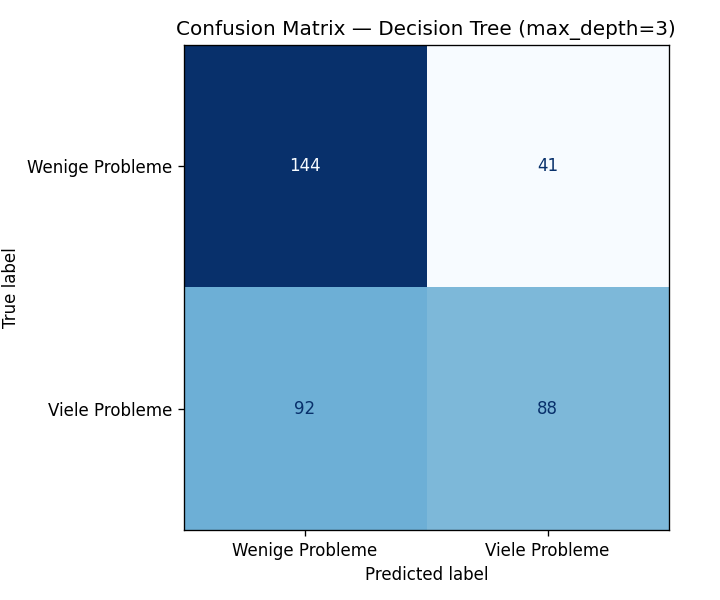
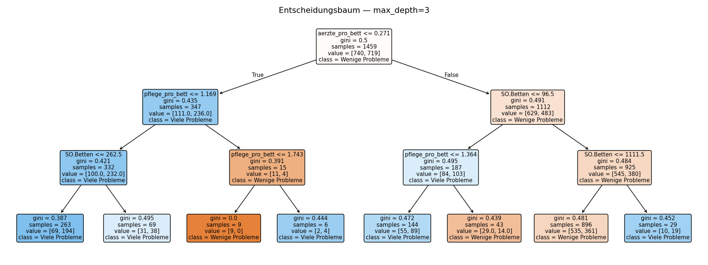
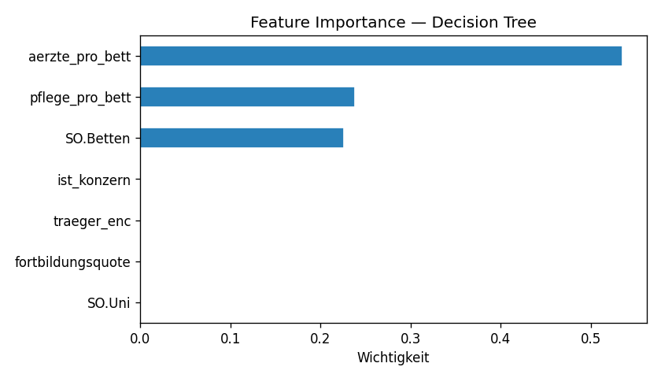

# 🤖 03_Decision_Tree.ipynb — Was wurde gemacht und warum?

> Dieses Dokument erklärt Schritt für Schritt, was im Notebook `Notebooks/03_Decision_Tree.ipynb` passiert — und warum jeweils so entschieden wurde. Ergebnis: ein trainierter und gespeicherter Decision-Tree-Klassifikator, drei Grafiken (`grafiken/`) und eine quantitative Aussage darüber, wie gut Strukturmerkmale von Krankenhäusern Qualitätsprobleme vorhersagen können.

**Projektfrage:** Können Strukturmerkmale eines Krankenhauses (Größe, Träger, Personal, …) maschinell vorhersagen, ob es überdurchschnittlich viele Qualitätsprobleme hat?

**IHK-Themen abgedeckt:** Decision Tree, Metriken (Accuracy / Precision / Recall / F1 / Confusion Matrix), R², OOP (`KrankenhausModell`-Klasse), joblib

### Übergang von 02_Analyse.ipynb: Deskriptiv → Prädiktiv

`02_Analyse.ipynb` hat durch Histogramme, Boxplots und statistische Tests gezeigt, **welche** Merkmale mit Qualitätsproblemen zusammenhängen (Ärzte pro Bett, Pflege pro Bett, Trägerschaft) — und welche nicht (Fortbildungsquote, Uni-Status). Dieses Notebook geht einen Schritt weiter: Statt einzelne Merkmale isoliert zu testen, werden **alle sieben Merkmale gleichzeitig** in einem Machine-Learning-Modell kombiniert und gefragt: *Wie gut kann man damit ein Krankenhaus korrekt klassifizieren?*

---

## 1. Setup & Daten laden

**Was:** Imports, Arbeitsverzeichnis auf Projekt-Root setzen (das Notebook liegt in `/Notebooks/`, alle Pfade sind relativ zur Root), `analysetabelle.csv` laden.

**Bibliotheken:**
- `scikit-learn` — Decision Tree, Metriken, Train-Test-Split, Cross-Validation, Lineare Regression
- `joblib` — Modell serialisieren (Speichern/Laden)
- `matplotlib` — Baumvisualisierung und Confusion Matrix

**Ergebnis:** 1.824 Zeilen × 18 Spalten, dieselbe Datei wie in Baustein 2.

---

## 2. OOP — Modell-Pipeline als Klasse (`KrankenhausModell`)

**Was:** Die gesamte ML-Pipeline ist als Python-Klasse in `model/modell_klasse.py` ausgelagert. Das Notebook importiert sie mit:

```python
from modell_klasse import KrankenhausModell
```

**Warum eine Klasse statt einzelner Funktionen?**
Die IHK-Aufgabenstellung verlangt explizit den Einsatz von OOP. Gleichzeitig hat die Klasse einen echten praktischen Nutzen: Dieselbe `KrankenhausModell`-Klasse wird sowohl hier beim Training als auch im Streamlit-Dashboard (`dashboard_utils.py`) zum Laden und Vorhersagen verwendet — eine einzige Definition, zwei Verwendungsorte, kein doppelter Code.

**Was macht die Klasse?**

| Methode | Aufgabe |
|---|---|
| `__init__(max_depth, random_state)` | Initialisiert `DecisionTreeClassifier` + `LabelEncoder` |
| `prepare(df)` | Features aufbereiten: `KH.Träger.Art` label-encoden → `traeger_enc`, fehlende Werte mit Median auffüllen |
| `fit(X_train, y_train)` | Modell trainieren |
| `evaluate(X_test, y_test)` | Accuracy, Precision, Recall, F1, Confusion Matrix berechnen |
| `save(path)` | Modell mit `joblib.dump()` speichern |
| `load(path)` | Modell mit `joblib.load()` laden (statische Methode) |

**Features (7 Merkmale):**

| Feature | Quelle | Bedeutung |
|---|---|---|
| `SO.Betten` | SO.csv | Krankenhausgröße |
| `SO.Uni` | SO.csv | Uni-Klinik (0/1) |
| `fortbildungsquote` | AM.csv | Anteil fortgebildeter Ärzte |
| `aerzte_pro_bett` | FA.csv | Ärzte-Personalstärke relativ zur Größe |
| `pflege_pro_bett` | AQ.Pflege.csv | Pflege-Personalstärke relativ zur Größe |
| `ist_konzern` | Konzern.csv | Teil eines Krankenhauskonzerns (0/1) |
| `traeger_enc` | SO.csv | Trägerart codiert (freigemeinnützig=0, öffentlich=1, privat=2) |

**Ziel-Variable:** `hat_viele_Probleme` (0 = wenige, 1 = viele) — binäre Klassifikation.

---

## 3. Train-Test-Split & Basislinie

**Was:** Datensatz 80/20 aufgeteilt, stratifiziert nach der Ziel-Variable.

| | Häuser | Anteil |
|---|---|---|
| Training | 1.459 | 80 % |
| Test | 365 | 20 % |

**Warum stratifiziert?** Ohne `stratify=y` könnte der Zufall dafür sorgen, dass Trainings- und Testset unterschiedliche Anteile von 0/1-Häusern haben. Mit `stratify=y` wird garantiert, dass beide Sets dieselbe Klassenverteilung wie der Gesamtdatensatz aufweisen — das macht die Testergebnisse stabiler und vergleichbarer.

**Warum `random_state=42`?** Reproduzierbarkeit: Jeder, der das Notebook erneut ausführt, erhält exakt dieselbe Aufteilung.

**Basislinie (Naive-Classifier):** 50,7 % — die häufigste Klasse für alle Häuser vorhersagen. Das Modell muss diese Marke deutlich übertreffen, um nützlich zu sein.

---

## 4. Decision Tree trainieren & bewerten

**Hyperparameter:** `max_depth=3` — der Baum darf maximal 3 Ebenen tief verzweigen.

**Warum `max_depth=3`?** Ohne Tiefenbegrenzung würde der Baum den Trainingsdatensatz fast perfekt auswendig lernen (Overfitting). Mit `max_depth=3` entsteht ein verständlicher, generalisierbarer Baum mit 8 Blättern — jede Entscheidungsregel ist im Baumsdiagramm (Grafik 2) direkt ablesbar.

### Metriken auf den Testdaten (365 Häuser):

| Metrik | Wert | Interpretation |
|---|---|---|
| **Accuracy** | **63,6 %** | 63,6 % der Häuser korrekt klassifiziert |
| **Precision** | **68,2 %** | Von allen als "viele Probleme" vorhergesagten Häusern stimmen 68,2 % |
| **Recall** | **48,9 %** | Von allen echten "Viele Probleme"-Häusern wurden 48,9 % erkannt |
| **F1-Score** | **57,0 %** | Harmonisches Mittel aus Precision & Recall |
| Basislinie | 50,7 % | Naiver Classifier: immer die Mehrheitsklasse vorhersagen |
| **Verbesserung** | **+12,9 %** | Mehrwert gegenüber dem naiven Ansatz |

**5-Fold Cross-Validation:** 59,7 % ± 4,2 % — Accuracy auf dem Trainingsdatensatz in 5 Faltungen. Der leichte Rückgang gegenüber den 63,6 % auf dem festen Testset ist normal; die Streuung von ±4,2 % zeigt, dass das Modell stabil ist und nicht von einer günstigen Zufallsaufteilung profitiert.

> **📌 Precision vs. Recall — Wann ist welche wichtiger?**
> - **Precision** (Genauigkeit der positiven Vorhersagen): Hohe Precision = wenn das Modell "Viele Probleme" sagt, stimmt es meist. Wichtig, wenn falsche Alarme teuer sind.
> - **Recall** (Trefferquote): Hoher Recall = das Modell findet die meisten echten Problemhäuser. Wichtig, wenn man keinen echten Fall verpassen darf.
> - Hier: Precision (68,2 %) ist höher als Recall (48,9 %) — das Modell ist vorsichtig mit der Vorhersage "Viele Probleme", verpasst dadurch aber gut die Hälfte der echten Fälle. Der F1-Score (57,0 %) ist der ausgewogene Gesamtwert.

### Confusion Matrix



Die Matrix zeigt die vier möglichen Vorhersageergebnisse auf den 365 Testhäusern:

|  | Vorhergesagt: Wenige | Vorhergesagt: Viele |
|---|---|---|
| **Tatsächlich: Wenige** | True Negative (TN) | False Positive (FP) |
| **Tatsächlich: Viele** | False Negative (FN) | True Positive (TP) |

- **TP** (True Positive): Korrekt als "Viele Probleme" erkannt
- **TN** (True Negative): Korrekt als "Wenige Probleme" erkannt
- **FP** (False Positive, falsche Alarme): Als "Viele" vorhergesagt, tatsächlich "Wenige"
- **FN** (False Negative, verpasste Fälle): Als "Wenige" vorhergesagt, tatsächlich "Viele"

Der hohe FN-Anteil spiegelt den Recall von 48,9 % wider — fast die Hälfte der echten Problemhäuser wird nicht erkannt.

---

## 5. Entscheidungsbaum visualisieren



**Was:** Der vollständige Baum mit `max_depth=3` (maximal 8 Blätter). Jeder Knoten zeigt:
- Die Entscheidungsregel (z. B. `aerzte_pro_bett ≤ 0.435`)
- Gini-Unreinheit des Knotens
- Anzahl Samples
- Klassenverteilung

**Wie den Baum lesen:** Man startet oben am Wurzelknoten und folgt für ein Krankenhaus dem Pfad nach links (Bedingung erfüllt) oder rechts (nicht erfüllt), bis man ein Blatt erreicht. Das Blatt gibt die Vorhersage an.

**Beobachtung:** `aerzte_pro_bett` erscheint als erste Verzweigung (Wurzel) — das wichtigste Merkmal im gesamten Modell.

---

## 6. Feature Importance



Die Feature Importance gibt an, wie stark jedes Merkmal zur Reduktion der Gini-Unreinheit beiträgt — je höher, desto öfter und weiter oben im Baum wird das Merkmal für Verzweigungen genutzt.

| Feature | Importance | Bedeutung |
|---|---|---|
| `aerzte_pro_bett` | **53,55 %** | Wichtigstes Merkmal — bestätigt Befund aus Baustein 2 |
| `pflege_pro_bett` | 23,84 % | Zweites Personalstärke-Merkmal |
| `SO.Betten` | 22,61 % | Krankenhausgröße |
| `traeger_enc` | 0,00 % | Trägerschaft — bei `max_depth=3` nicht genutzt |
| `fortbildungsquote` | 0,00 % | Konsistent mit Baustein 2: kein Zusammenhang |
| `SO.Uni` | 0,00 % | Konsistent mit Baustein 2: kein Unterschied |
| `ist_konzern` | 0,00 % | Kein Einfluss auf die 3 Baumebenen |

**Warum `traeger_enc` = 0, obwohl Baustein 2 einen Träger-Effekt zeigte?** Der T-Test in `02_Analyse.ipynb` hat Trägerschaft als statistisch signifikant identifiziert. Bei `max_depth=3` reicht der Baum aber nur für die drei stärksten Merkmale — Trägerschaft hat einen echten, aber schwächeren Effekt als die Personalstärken und fällt deshalb aus dem flachen Baum heraus. Mit `max_depth=4` oder `max_depth=5` würde `traeger_enc` wahrscheinlich erscheinen.

---

## 7. R²-Metrik — Lineare Regression zum Vergleich

**Was:** Parallel zum Decision Tree wurde eine lineare Regression auf dieselben sieben Features trainiert — einmal auf die binäre Ziel-Variable (0/1), einmal auf die kontinuierliche `auffaellig_quote`.

**Warum zusätzlich R²?** Der IHK-Anforderungskatalog nennt R² als Metrik. R² ist primär für Regression definiert (Anteil erklärter Varianz), ergänzt hier aber sinnvoll die Klassifikationsmetriken: Er gibt auf der kontinuierlichen Skala an, wie viel von der Variabilität der Auffälligkeitsquote die sieben Strukturmerkmale gemeinsam erklären können.

| Modell | Ziel-Variable | R²-Wert |
|---|---|---|
| Lineare Regression | `hat_viele_Probleme` (0/1) | 0,009 |
| Lineare Regression | `auffaellig_quote` (0–1, stetig) | **0,033** |

**Interpretation:** R² = 0,033 bedeutet: Die sieben Strukturmerkmale erklären gemeinsam **nur 3,3 %** der Varianz in der Auffälligkeitsquote. 96,7 % bleiben unerklärt — durch Faktoren, die im Datensatz nicht enthalten sind (Behandlungsqualität, Patientenstruktur, regionale Besonderheiten, Dokumentationsverhalten etc.).

**Lineare Regressionskoeffizienten (`auffaellig_quote`):**

| Feature | Koeffizient | Richtung |
|---|---|---|
| `aerzte_pro_bett` | −0,041 | Mehr Ärzte → tendenziell niedrigere Quote |
| `pflege_pro_bett` | −0,041 | Mehr Pflegekräfte → tendenziell niedrigere Quote |
| `fortbildungsquote` | −0,020 | Mehr Fortbildung → minimal niedrigere Quote |
| `SO.Uni` | −0,008 | Uni-Klinik → minimal niedrigere Quote |
| `SO.Betten` | −0,000 | Größe: praktisch kein Effekt |
| `traeger_enc` | +0,003 | Träger-Codierung: minimal positiv |
| `ist_konzern` | +0,001 | Konzernzugehörigkeit: praktisch kein Effekt |

**Richtung stimmt inhaltlich:** Mehr Personal pro Bett hängt mit niedrigerer Auffälligkeitsquote zusammen — die Vorzeichen sind plausibel. Der Effekt ist aber sehr klein.

> ⚠️ **Kein Zusammenhang ist ein valides Ergebnis.** Ein R² von 0,033 bedeutet nicht, dass die Analyse gescheitert ist — es bedeutet, dass die **verfügbaren Strukturdaten** die Qualitätsprobleme nicht gut vorhersagen können. Das ist eine substanzielle inhaltliche Aussage.

---

## 8. Modell speichern & laden (joblib)

**Was:** Das trainierte `KrankenhausModell`-Objekt wird mit `joblib.dump()` als Pickle-Datei gespeichert:

```
Data/modell_krankenhaus.pkl
```

`joblib` ist gegenüber `pickle` vorzuziehen für NumPy-Arrays und sklearn-Objekte, da es effizienter mit großen Arrays umgeht.

**Probe-Vorhersage (Beispiel-Krankenhaus):**

```python
beispiel = {
    'SO.Betten': 300, 'SO.Uni': 0,
    'fortbildungsquote': 0.8, 'aerzte_pro_bett': 0.4,
    'pflege_pro_bett': 1.0, 'ist_konzern': 0,
    'traeger_enc': 0  # freigemeinnützig
}
```

Das geladene Modell gibt sowohl eine binäre Vorhersage (0/1) als auch Wahrscheinlichkeiten für beide Klassen zurück — Grundlage für die Einzelvorhersage im Streamlit-Dashboard (Tab „Einzelvorhersage").

---

## 9. Zusammenfassung Baustein 4

| Metrik | Wert | Einordnung |
|---|---|---|
| **Accuracy** | **63,6 %** | +12,9 Prozentpunkte über Basislinie (50,7 %) |
| **Precision** | **68,2 %** | Vorhersage "viele Probleme" stimmt zu 2/3 |
| **Recall** | **48,9 %** | Fast die Hälfte der echten Fälle wird verpasst |
| **F1-Score** | **57,0 %** | Ausgewogener Gesamtwert |
| **CV-Accuracy** | **59,7 % ± 4,2 %** | Stabil, kein Overfitting |
| **R²** | **3,3 %** | Strukturmerkmale erklären Auffälligkeit kaum |
| **Wichtigstes Merkmal** | `aerzte_pro_bett` | 53,6 % Feature Importance |

### Wichtigste Erkenntnisse

1. **Der Baum übertrifft die Basislinie** — mit 63,6 % vs. 50,7 % ist das Modell besser als zufälliges Raten, aber weit entfernt von einer zuverlässigen Vorhersage.

2. **`aerzte_pro_bett` ist mit Abstand das wichtigste Merkmal** (53,6 %) — konsistent mit Baustein 2 (T-Test: p < 0,001, stärkste grafische Verschiebung im Boxplot).

3. **Trägerschaft fällt aus dem flachen Baum heraus**, obwohl sie in Baustein 2 statistisch signifikant war — der Effekt ist real, aber schwächer als Personalstärken.

4. **R² = 3,3 % ist das zentrale Ergebnis:** Krankenhausstruktur allein kann Qualitätsprobleme nicht vorhersagen. Kein Zusammenhang ist ein valides Ergebnis — und eine relevante Aussage für die Projektfrage.

5. **Modell ist einsatzbereit:** `Data/modell_krankenhaus.pkl` wird direkt vom Streamlit-Dashboard geladen für Live-Einzelvorhersagen.
