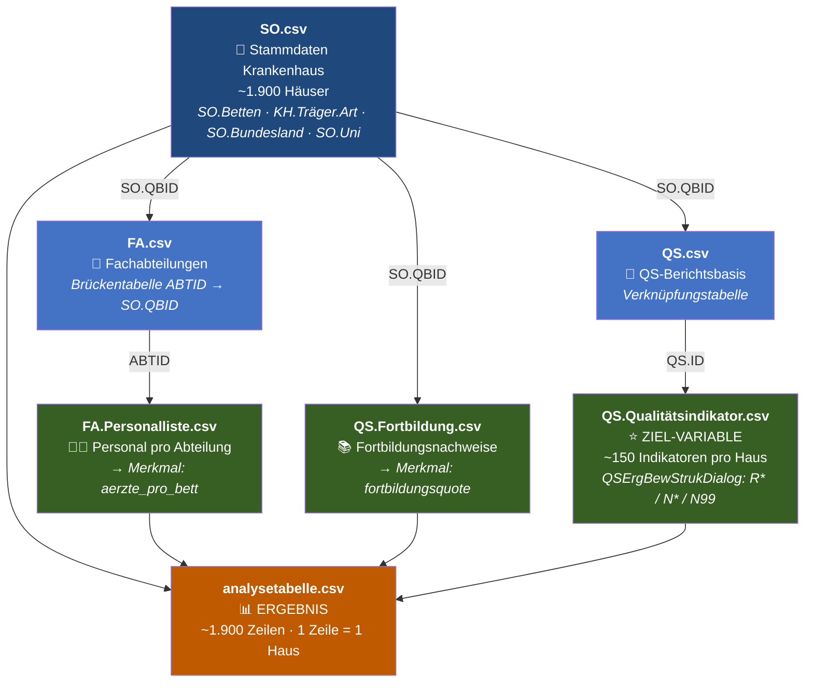

# 📂 Inhaltsverzeichnis — Datensatz Qualitäts-Muster-Finder

| | |
|---|---|
| **Quelle** | Ordner `Data/` im Projektverzeichnis |
| **Herkunft** | Offizielle Qualitätsberichte deutscher Krankenhäuser, 2023, veröffentlicht vom IQTIG (G-BA) |
| **Dateien** | 86 CSV-Dateien · ca. 1,2 GB |
| **Schlüssel** | `SO.QBID` — verbindet fast alle Tabellen (eindeutige Standort-ID) |

---

## Übersichtstabelle

### Datenart — Erklärung der Kategorien

| Datenart | Bedeutung | Herkunft im Qualitätsbericht |
|----------|-----------|------------------------------|
| **Strukturdaten (A-Teil)** | Beschreibt, **wie ein Krankenhaus aufgebaut ist**: Größe, Personal, Träger, Standort, Ausstattung. Der „A-Teil" ist der erste Hauptabschnitt des offiziellen deutschen Qualitätsberichts — „A" steht für **Allgemeiner Teil**. Diese Daten sind unsere **Merkmale (Features X)** für die Analyse. | Abschnitte A-1 bis A-7 des Qualitätsberichts |
| **Qualitätsdaten (C-Teil)** | Beschreibt, **wie gut die medizinische Versorgung ist**: Qualitätsindikatoren, Bewertungen, Fortbildung. Der „C-Teil" steht für **Qualitätssicherung** — den dritten Hauptteil des Berichts. Diese Daten liefern unsere **Ziel-Variable (y)**. | Abschnitte C-1 bis C-5 des Qualitätsberichts |
| **Verknüpfung** | Enthält **keine eigenen Analysedaten**, sondern verbindet zwei andere Tabellen über gemeinsame IDs (Joins). Ohne diese Tabellen können die Daten nicht zusammengeführt werden. | Technische Hilfstabellen |
| **Lookup** | Reine **Dekodierungstabellen**: übersetzen Codes in lesbare Bezeichnungen (z. B. ICD-Code → Krankheitsname). Kein eigener Analysewert — die eigentlichen Daten stehen in anderen Tabellen. | Schlüsseltabellen / Codelisten |
| **Links** | Enthält nur **URLs zu externen Webseiten** der Krankenhäuser. Keine Zahlenwerte, keine Merkmale, kein Analysewert. | Weiterführende Verweise |

### Relevanz-Legende

| Symbol | Bedeutung |
|--------|-----------|
| ✅ **JA** | Datei wird aktiv in der Analyse verwendet — Spalten sind in `analysetabelle.csv` eingeflossen |
| ⚠️ **Möglicherweise** | Datei wurde identifiziert und enthält potenziell nützliche Daten, aber noch **nicht eingebunden**. Kandidat für Folgeanalysen |
| ❌ **NEIN** | Datei bewusst ausgeschlossen — entweder kein Analysebezug, zu spezifisch, Verwaltungsdaten oder Redundanz mit einer verwendeten Datei |

---

| Datenart | Struktur | Dateiname | Wichtige Spalten | Relevant | Warum |
|----------|----------|-----------|------------------------------|----------|-------|
| **Strukturdaten (A-Teil)** | Krankenhaus-Stammdaten | `SO.csv` | `SO.Betten`, `KH.Träger.Art`, `SO.Bundesland`, `SO.Uni`, `SO.Latitude/Longitude`, `SO.QBID` | ✅ **JA** | Einzige Datei mit allen Strukturmerkmalen der Aufgabenstellung in einer Tabelle. `SO.QBID` = Primärschlüssel für alle Joins |
| **Strukturdaten (A-Teil)** | Personal pro Fachabteilung | `FA.Personalliste.csv` | `ABTID`, `FA.Personal.Bereich` (Ärzte/Pflege), `FA.Personal.Anzahl` ⚠️ Komma-Dezimal | ✅ **JA** | Einzige Quelle für Vollzeit-Ärzteanzahl → `aerzte_pro_bett`. **Feature Importance 71,3 %** im Decision Tree |
| **Strukturdaten (A-Teil)** | Fortbildungsnachweise | `QS.Fortbildung.csv` | `SO.QBID`, `QS.Fortbildungspflichtige`, `QS.Fortbildungsnachweis_Erbracht_Habende` | ✅ **JA** | Aufgabenstellung nennt Fortbildungsquote explizit → `fortbildungsquote = Erbracht / Pflichtige` |
| **Verknüpfung** | Fachabteilungen (Brückentabelle) | `FA.csv` | `ABTID`, `FA.QBID` (= `SO.QBID`), `FA.Name`, `FA.FZ.Voll` | ✅ **JA** | Verbindet `ABTID` (aus FA.Personalliste) mit `SO.QBID`. Ohne diese Datei kein Join zwischen Personal und Krankenhaus |
| **Verknüpfung** | QS-Berichtsbasis | `QS.csv` | `QS.ID`, `SO.QBID`, `QS.Typ` (bund/land) | ✅ **JA** | Verbindet `QS.Qualitätsindikator.csv` mit Standortdaten. Enthält `QS.Typ` (bundesweit vs. landesspezifisch) |
| **Qualitätsdaten (C-Teil)** | Qualitätsindikatoren mit Bewertungen | `QS.Qualitätsindikator.csv` ⚠️ >50 MB | `QSErgBewStrukDialog` (R\*/N\*/N99), `QSQI.Indikator`, `QSQI.ArtDesWertes`, `SO.QBID` | ✅ **JA** | **Ziel-Variable.** Einzige standardisierte auffällig-Bewertung (R\* = auffällig) für ~1.900 Häuser |
| **Qualitätsdaten (C-Teil)** | Leistungsbereiche / Dokumentationsraten | `QS.Leistungsbereich.csv` | `SO.QBID`, `QSLB.Leistungsbereich`, `QSLB.Dokumentationsrate`, `QSLB.Fallzahl` | ⚠️ **Möglicherweise** | `QSLB.Dokumentationsrate` = potenzielle Qualitätskennzahl. Noch nicht in Analysetabelle eingebunden |
| **Qualitätsdaten (C-Teil)** | Externe QS-Ergebnisse (Zahlen) | `QS.Extern.Sonstige.csv` | `Externe.QS.Leistungsbereich`, `Externe.QS.Ergebnis`, `SO.QBID` | ⚠️ **Möglicherweise** | Alternative Ziel-Variable; keine einheitliche auffällig-Bewertung — Überschneidung mit QS.Qualitätsindikator unklar |
| **Qualitätsdaten (C-Teil)** | Behandlungsumfang | `QS.Behandlungsumfang.csv` | `SO.QBID` | ⚠️ **Möglicherweise** | Ergänzung zu QS.Leistungsbereich; noch nicht gesichtet |
| **Strukturdaten (A-Teil)** | Mindestmengen | `MM.csv` | `MM.Erbracht`, `MM.Mindestmenge`, `MM.Differenz`, `MM.LB.Kurz`, `SO.QBID` | ⚠️ **Möglicherweise** | Strukturmerkmal: Erfüllt ein Haus seine Mindestmengen? Nicht verwendet |
| **Strukturdaten (A-Teil)** | Mindestmengen-Ausnahmen | `MM.Ausnahme.csv` | `SO.QBID` | ⚠️ **Möglicherweise** | Ergänzung zu `MM.csv` |
| **Strukturdaten (A-Teil)** | Mindestmengen-Prognosen | `MM.Leistungsberechtigung.Prognose.csv` | `SO.QBID` | ⚠️ **Möglicherweise** | Ergänzung zu `MM.csv` |
| **Strukturdaten (A-Teil)** | Zertifizierungen | `CQ.csv` | `CQ.Key`, `SO.QBID` | ⚠️ **Möglicherweise** | Welche Zertifizierungen hat ein Haus? Strukturmerkmal — nicht verwendet |
| **Strukturdaten (A-Teil)** | Ausstattungsmerkmale | `AM.csv` | `SO.QBID` | ⚠️ **Möglicherweise** | Strukturmerkmal; noch nicht gesichtet |
| **Strukturdaten (A-Teil)** | Ausstattung Leistungen | `AM.Leistung.csv` | `SO.QBID` | ⚠️ **Möglicherweise** | Ergänzung zu `AM.csv` |
| **Strukturdaten (A-Teil)** | Ausstattung VAVU | `AM.VAVU.csv` | `SO.QBID` | ⚠️ **Möglicherweise** | Ergänzung zu `AM.csv` |
| **Strukturdaten (A-Teil)** | Behandlungsfelder | `BF.csv` | `BF`, `BF.Erläuterung`, `BF.Key`, `SO.QBID` | ⚠️ **Möglicherweise** | Bedeutung von BF.Key für Analyse unklar |
| **Strukturdaten (A-Teil)** | Behandlungsmöglichkeiten | `BM.csv` | `SO.QBID` | ⚠️ **Möglicherweise** | Strukturmerkmal; noch nicht gesichtet |
| **Strukturdaten (A-Teil)** | Arzneimitteltherapiesicherheit | `AMTS.csv` | `SO.QBID` | ⚠️ **Möglicherweise** | Qualitätsmerkmal; Bedeutung für Auffälligkeitsquote unklar |
| **Strukturdaten (A-Teil)** | AMTS-Maßnahmen | `AMTS_Massnahme.csv` | `SO.QBID` | ⚠️ **Möglicherweise** | Ergänzung zu `AMTS.csv` |
| **Strukturdaten (A-Teil)** | Konzernzugehörigkeiten | `Konzern.csv` | `SO.QBID` | ⚠️ **Möglicherweise** | Träger-Info (Konzern vs. unabhängig); identifiziert, aber nicht eingebunden |
| **Strukturdaten (A-Teil)** | Risikomanagement | `RM.csv` | `SO.QBID` | ⚠️ **Möglicherweise** | Strukturmerkmal; noch nicht gesichtet |
| **Strukturdaten (A-Teil)** | RM Fallbesprechungen | `RM.Fallbesprechung.csv` | `SO.QBID` | ⚠️ **Möglicherweise** | Ergänzung zu `RM.csv` |
| **Strukturdaten (A-Teil)** | Notfallversorgungsstufen | `Notfallversorgung.csv` | `SO.QBID` | ⚠️ **Möglicherweise** | Strukturmerkmal; noch nicht gesichtet |
| **Strukturdaten (A-Teil)** | Mindestpersonalbedarf | `MP.csv` | `SO.QBID` | ⚠️ **Möglicherweise** | Personalstruktur; noch nicht gesichtet |
| **Strukturdaten (A-Teil)** | Hygienedaten Basis | `HB.csv` | `SO.QBID` | ⚠️ **Möglicherweise** | Mögliches Qualitätsmerkmal; noch nicht gesichtet |
| **Strukturdaten (A-Teil)** | Hygienedaten Detail | `HD.csv` (40 MB) | `SO.QBID` | ⚠️ **Möglicherweise** | Detaillierte Hygienedaten; >50 MB — nicht direkt in VS Code öffenbar |
| **Strukturdaten (A-Teil)** | Hygiene-Maßnahmen | `HM.csv` | `SO.QBID` | ⚠️ **Möglicherweise** | Ergänzung Hygiene |
| **Strukturdaten (A-Teil)** | Weitere Hygienedaten | `WeitereHygiene.csv` | `SO.QBID` | ⚠️ **Möglicherweise** | Ergänzung Hygiene |
| **Strukturdaten (A-Teil)** | KISS-Infektionssurveillance | `KISS.csv` | `SO.QBID` | ⚠️ **Möglicherweise** | Qualitätsmerkmal Infektionen; noch nicht gesichtet |
| **Qualitätsdaten (C-Teil)** | Personalstunden Psychiatrie | `QS.Pso.csv` | `QS.Pso.Berufsgruppen`, `QS.Einrichtung.ID` | ⚠️ **Möglicherweise** | Nur psychiatrische Einrichtungen — zu spezifisch für allg. Analyse |
| **Qualitätsdaten (C-Teil)** | Stationsstruktur Psychiatrie | `QS.Struktur.Station.csv` | `QS.Station.Planbetten`, `QS.Station.Typ` | ⚠️ **Möglicherweise** | Nur Psychiatrie-Häuser |
| **Qualitätsdaten (C-Teil)** | Psychiatrie-Qualitätsdaten | `QS.Psy.csv` | `SO.QBID` | ⚠️ **Möglicherweise** | Nur Psychiatrie — zu spezifisch |
| **Strukturdaten (A-Teil)** | Qualifikation Ärzte | `AQ.Ärzte.csv` | `SO.QBID` | ❌ **NEIN** | Qualifikationen, keine Anzahlen. `FA.Personalliste.csv` wurde verwendet |
| **Strukturdaten (A-Teil)** | Qualifikation Pflege | `AQ.Pflege.csv` | `SO.QBID` | ❌ **NEIN** | Alternative zu FA.Personalliste; nicht verwendet |
| **Strukturdaten (A-Teil)** | Personal auf Standortebene | `SO.Personalliste.csv` | `SO.QBID` | ❌ **NEIN** | Alternative zu FA.Personalliste; weniger detailliert |
| **Strukturdaten (A-Teil)** | Einzelpersonen Fachabteilungen | `FA.Personen.csv` | `ABTID` | ❌ **NEIN** | Zu granular; FA.Personalliste.csv wurde verwendet |
| **Strukturdaten (A-Teil)** | Personaldaten allgemein | `Personen.csv` | — | ❌ **NEIN** | ⚠️ DSGVO: personenbezogen. Redundanz mit FA.Personalliste |
| **Strukturdaten (A-Teil)** | Geriatrische Indikatoren | `GIQI.csv` | `SO.QBID` | ❌ **NEIN** | Fachspezifisch; keine allg. Relevanz |
| **Strukturdaten (A-Teil)** | VAVU-Daten | `VAVU.csv` (14 MB) | `SO.QBID` | ❌ **NEIN** | Versorgungsstruktur; nicht gesichtet |
| **Strukturdaten (A-Teil)** | Schutzkonzepte | `Schutzkonzept.csv` | `SO.QBID` | ❌ **NEIN** | Zu spezifisch |
| **Strukturdaten (A-Teil)** | Prävention Missbrauch | `Praevention_Missbrauch_und_Gewalt.csv` | `SO.QBID` | ❌ **NEIN** | Zu spezifisch |
| **Strukturdaten (A-Teil)** | Sicherstellungszuschläge | `Sicherstellungszuschlaege.csv` | `SO.QBID` | ❌ **NEIN** | Verwaltungsdaten |
| **Strukturdaten (A-Teil)** | Neuartige Therapien | `Neuartige_Therapien.csv` | `SO.QBID` | ❌ **NEIN** | Zu spezifisch |
| **Strukturdaten (A-Teil)** | Akademische Lehre | `Akademische_Lehre.csv` | `SO.QBID` | ❌ **NEIN** | Eher Metadaten |
| **Strukturdaten (A-Teil)** | Lenkungsgremien | `Lenkungsgremium.csv` | `SO.QBID` | ❌ **NEIN** | Organisationsstruktur; Relevanz unklar |
| **Strukturdaten (A-Teil)** | Zusatzvereinbarungen | `ZV.csv` | `SO.QBID` | ❌ **NEIN** | Strukturmerkmal; nicht gesichtet |
| **Strukturdaten (A-Teil)** | Nicht-medizinische Angebote | `NM.csv` | `SO.QBID` | ❌ **NEIN** | Parkplatz, Telefon, Ernährung — kein Analysebezug |
| **Strukturdaten (A-Teil)** | Pflegepersonalregelung | `Pflegepersonalregelung.csv` | `SO.QBID` | ❌ **NEIN** | Verwaltungsdaten |
| **Strukturdaten (A-Teil)** | Personalvorgaben | `ErfPersVorgaben.csv` | `SO.QBID` | ❌ **NEIN** | Verwaltungsdaten |
| **Qualitätsdaten (C-Teil)** | Nachweiszeiträume | `QS.Nachweis.csv` | — | ❌ **NEIN** | Nur technische Meta-Info |
| **Qualitätsdaten (C-Teil)** | Bewertungen Strukturierter Dialog | `BewertungStrukDialog.csv` | — | ❌ **NEIN** | Erläutert QSErgBewStrukDialog; Relevanz unklar |
| **Qualitätsdaten (C-Teil)** | Landesrechtliche QS | `QS.Landesrecht.csv` | — | ❌ **NEIN** | Länderspezifisch; nicht gesichtet |
| **Lookup** | ICD-Diagnoseschlüssel | `ICD.Code.csv` | — | ❌ **NEIN** | Nur Lookup-Tabelle |
| **Lookup** | OPS-Schlüssel | `OPS.Code.csv`, `OPS.csv` | — | ❌ **NEIN** | Nur Lookup-Tabelle |
| **Lookup** | Einrichtungstypen | `QS.Einrichtungstypen.csv` | — | ❌ **NEIN** | Nur Lookup |
| **Lookup** | Berufsgruppen | `QS.Berufsgruppen.csv` | — | ❌ **NEIN** | Nur Lookup |
| **Lookup** | Alle `*.Key.csv` | `AA.Key.csv`, `AM.Key.csv`, `AM.VAVU.Key.csv`, `AQZF.Key.csv`, `BF.Key.csv`, `CQ.Key.csv`, `EF.Key.csv`, `HM.Key.csv`, `IF.Key.csv`, `LK.Key.csv`, `MM.Key.csv`, `MP.Key.csv`, `NM.Key.csv`, `PQZP.Key.csv`, `RM.Key.csv`, `VAVU.Key.csv` | — | ❌ **NEIN** | Schlüssel-/Lookup-Tabellen ohne Analysedaten |
| **Links** | URL-Links | `Link.csv`, `LinkVersorgunggebieteSO.csv`, `Weiterführender_Link.csv` | — | ❌ **NEIN** | Keine Analysedaten |

---

## 🗺️ Datenmodell — Beziehungen

### Diagramm (Mermaid — wird in VS Code mit Erweiterung gerendert)

---

### Verbindungen — Join-Schlüssel erklärt

| Von | Join-Schlüssel | Nach | Warum dieser Join? |
|-----|---------------|------|--------------------|
| `SO.csv` | `SO.QBID` | `QS.csv` | Jeder Qualitätsbericht-Datensatz gehört zu einem Standort |
| `QS.csv` | `QS.ID` | `QS.Qualitätsindikator.csv` | Qualitätsindikatoren sind dem QS-Bericht eines Hauses zugeordnet |
| `SO.csv` | `SO.QBID` | `QS.Fortbildung.csv` | Fortbildungsdaten direkt auf Standortebene verfügbar |
| `SO.csv` | `SO.QBID` | `FA.csv` | Fachabteilungen gehören zu einem Standort |
| `FA.csv` | `ABTID` | `FA.Personalliste.csv` | Personaldaten sind abteilungsweise gespeichert — `FA.csv` liefert die Zuordnung zur Haus-ID |

> **Warum der Umweg über FA.csv?**  
> `FA.Personalliste.csv` enthält nur `ABTID` (Abteilungs-ID), aber **nicht** `SO.QBID` (Haus-ID).  
> `FA.csv` ist die einzige Tabelle, die beide Schlüssel hat (`ABTID` + `FA.QBID` = `SO.QBID`).  
> Ohne `FA.csv` kann man die Ärzteanzahl nicht dem richtigen Krankenhaus zuordnen.

---

### Was entsteht: Spalten der analysetabelle.csv

| Spalte | Typ | Quelle | Beschreibung |
|--------|-----|--------|--------------|
| `SO.QBID` | ID | `SO.csv` | Eindeutige Krankenhaus-Standort-ID — Primärschlüssel |
| `SO.Name` | Text | `SO.csv` | Name des Krankenhauses |
| `SO.Betten` | Zahl | `SO.csv` | Bettenzahl — Größenindikator |
| `KH.Träger.Art` | Kategorie | `SO.csv` | `privat` / `freigemeinnützig` / `öffentlich` |
| `SO.Bundesland` | Kategorie | `SO.csv` | Region (16 Bundesländer) |
| `SO.Uni` | 0/1 | `SO.csv` | Universitätsklinikum ja/nein |
| `aerzte_pro_bett` | Dezimal | `FA.Personalliste` + `FA.csv` + `SO.csv` | Vollzeit-Ärzte ÷ Betten — **wichtigstes Merkmal (FI 71,3 %)** |
| `fortbildungsquote` | Dezimal | `QS.Fortbildung.csv` | Erbrachte Fortbildungen ÷ Pflichtige |
| `auffaellig_n` | Zahl | `QS.Qualitätsindikator.csv` | Anzahl Indikatoren mit R\*-Bewertung |
| `total_qi` | Zahl | `QS.Qualitätsindikator.csv` | Gesamtzahl bewerteter Indikatoren |
| `auffaellig_quote` | Dezimal | berechnet | `auffaellig_n / total_qi` |
| `hat_viele_Probleme` | 0/1 | berechnet | 1 wenn `auffaellig_quote` > Median (76,92 %) — **Ziel-Variable (y)** |

---

## 🔬 Wo und wie wurde die Analyse durchgeführt?

### Analyse-Notebook

**Datei:** `01_Exploration.ipynb` im Projektverzeichnis  
**Sprache:** Python 3 (pandas, numpy)  
**Ausführung:** Jupyter Notebook in VS Code

---

### Analyseschritte im Notebook — Schritt für Schritt

| Abschnitt im Notebook | Was wurde gemacht | Verwendete Dateien | Ergebnis |
|-----------------------|-------------------|---------------------|----------|
| **Datei-Listing** | Alle 86 CSV-Dateien mit Größe aufgelistet | `Data/*.csv` | Übersicht: 86 Dateien · 1,2 GB · größte Datei 911 MB |
| **🔗 Tabellenverbindungen** | Alle CSV-Header eingelesen (`nrows=0`), gemeinsame Spaltennamen gezählt, Datei-Präfix-Logik analysiert | Alle 86 CSVs (nur Header) | `SO.QBID` erscheint in ~60 Dateien → universeller Join-Schlüssel bestätigt |
| **1️⃣ Stammdaten** | `SO.csv` geladen, relevante Spalten ausgewählt, Träger- und Uni-Verteilung geprüft | `SO.csv` | ~1.900 Krankenhäuser · 3 Trägerarten · Geo-Koordinaten vorhanden |
| **2️⃣ Qualitätsindikatoren** | Erst nur Header (`nrows=5`), dann vollständige Datei geladen. Bewertungsspalte gesucht und `QSErgBewStrukDialog` als Schlüsselspalte identifiziert. Alle Spalten mit niedriger Kardinalität untersucht. | `QS.Qualitätsindikator.csv` (911 MB) | Bewertungscodes: `R*` = auffällig · `N*` = nicht auffällig · `N99` = nicht bewertet |
| **3️⃣ Ziel-Variable** | Nur echte QI-Zeilen (`QSQI.ArtDesWertes == 'QI'`), N99 ausgeschlossen, Duplikate entfernt, Quote berechnet, Median-Schwelle gesetzt | `QS.Qualitätsindikator.csv` | `hat_viele_Probleme = 1` wenn Quote > Median (76,92 %) |
| **4️⃣ Fortbildungsquote** | Fortbildungsdaten geladen, Quote berechnet: Erbrachte ÷ Pflichtige | `QS.Fortbildung.csv` | `fortbildungsquote` pro Haus verfügbar |
| **5️⃣ Analysetabelle** | Alle Teile per `SO.QBID` zusammengeführt, fehlende Werte geprüft, erste Version gespeichert | `SO.csv` + `QS.Qualitätsindikator.csv` + `QS.Fortbildung.csv` | `analysetabelle.csv` — erste Version |
| **6️⃣ Ärzte pro Bett** | `FA.Personalliste.csv` über `FA.csv` (Brücke) mit `SO.csv` gejoint, Komma-Dezimal konvertiert, Ärzte pro Haus aggregiert, durch Bettenzahl dividiert | `FA.csv` + `FA.Personalliste.csv` + `SO.csv` | `aerzte_pro_bett` in Analysetabelle eingebunden |

---

### Schlüsse aus der Analyse

| Schluss | Belegt durch | Bedeutung |
|---------|-------------|-----------|
| **`SO.QBID` ist der universelle Schlüssel** | Tabellenverbindungs-Analyse: Spalte kommt in ~60 von 86 Dateien vor | Alle Tabellen können über eine einzige ID verknüpft werden |
| **`QSErgBewStrukDialog` ist die Ziel-Spalte** | Exploration Schritt 2: einzige Spalte mit standardisierter R\*/N\*-Bewertung für alle Häuser | Ohne diese Spalte keine vergleichbare Ziel-Variable möglich |
| **N99 muss ausgeschlossen werden** | Schritt 3: N99 = nicht bewertet — ist nicht gleich „nicht auffällig" | Falsche Einbeziehung würde die Quote systematisch verfälschen |
| **Duplikate müssen entfernt werden** | Schritt 3: `QSQI.AEKey` ist eine Haus-ID, kein Indikator-Schlüssel → Deduplizierung über `(SO.QBID, QSQI.Indikator)` | Ohne Deduplizierung werden einzelne Indikatoren mehrfach gezählt |
| **Komma-Dezimal in `FA.Personal.Anzahl`** | Schritt 6: Wert `"13,47"` statt `13.47` — muss vor Aggregation konvertiert werden | Ohne Konvertierung werden Summen falsch berechnet (String statt Float) |
| **`aerzte_pro_bett` = wichtigster Prädiktor** | Ergebnis Decision Tree: Feature Importance **71,3 %** | Größter Erklärungsbeitrag für `hat_viele_Probleme` im Modell |
| **Tageskliniken bekommen NaN bei aerzte_pro_bett** | Schritt 6: `SO.Betten == 0` → Division durch 0 → NaN | Korrekt: Tageskliniken haben kein stationäres Bettenprofil |
| **Median der auffällig-Quote liegt bei 76,92 %** | Schritt 3: `auffaellig_quote.median()` | Überraschend hoch — bedeutet: typisches Haus hat ~77 % seiner Indikatoren im auffälligen Bereich |

---

## 📌 Wichtige Erkenntnisse

| # | Erkenntnis |
|---|-----------|
| 1 | `SO.QBID` ist der universelle Schlüssel — alle Tabellen über diese ID verknüpfbar |
| 2 | `QS.Qualitätsindikator.csv` ist >50 MB — muss mit `pd.read_csv()` in Python geladen werden |
| 3 | `FA.Personal.Anzahl` verwendet Komma als Dezimalzeichen (`"13,47"`) — muss konvertiert werden |
| 4 | `aerzte_pro_bett` = wichtigster Prädiktor (Decision Tree Feature Importance **71,3 %**) |
| 5 | Ziel-Variable: `auffaellig_quote = R*-Indikatoren / Gesamt-Indikatoren` pro Haus |
| 6 | Träger-Kategorien in `SO.csv` → `KH.Träger.Art`: `privat` \| `freigemeinnützig` \| `öffentlich` |

---

## ⚠️ DSGVO-Hinweis

| Datei | Art der Daten | Maßnahme |
|-------|--------------|----------|
| `Personen.csv` | Vorname, Nachname, E-Mail, Telefon (Kontaktpersonen) | Nicht in Analyse; `Data/` per `.gitignore` ausgeschlossen |
| `FA.Personen.csv` | Vorname, Nachname, E-Mail (ärztl. Leitungen) | Nicht in Analyse; `Data/` per `.gitignore` ausgeschlossen |

---

## 📖 Glossar — Spalten- und Datei-Abkürzungen

### Datei-Präfixe (vor dem Punkt im Dateinamen)

| Präfix | Ausgeschrieben | Bedeutung |
|--------|---------------|-----------|
| `SO` | Standort | Stammdaten eines Krankenhaus-Standorts |
| `QS` | Qualitätssicherung | Daten aus dem C-Teil des Qualitätsberichts (Qualitätsindikatoren, Fortbildung, Leistungsbereiche) |
| `FA` | Fachabteilung | Daten zu den medizinischen Abteilungen eines Hauses |
| `MM` | Mindestmengen | Gesetzliche Mindestfallzahlen für bestimmte Eingriffe |
| `AM` | Ausstattungsmerkmale | Medizinisch-technische Geräte und Ausstattung |
| `AQ` | Ärztliche Qualifikation | Qualifikationsnachweise des ärztlichen Personals |
| `RM` | Risikomanagement | Systeme zur Vermeidung medizinischer Fehler |
| `BF` | Behandlungsfelder | Kategorisierung der Behandlungsschwerpunkte |
| `BM` | Behandlungsmöglichkeiten | Angebotene Behandlungen und Therapien |
| `CQ` | Strukturqualität / Zertifizierungen | Zertifizierungen und Strukturqualitätsvereinbarungen |
| `HB` | Hygiene Basis | Basishygienedaten des Krankenhauses |
| `HD` | Hygiene Detail | Detaillierte Hygienedaten |
| `HM` | Hygiene Maßnahmen | Konkrete Hygienemaßnahmen |
| `NM` | Nicht-medizinische Angebote | Serviceangebote (Parkplatz, WLAN, Cafeteria …) |
| `MP` | Mindestpersonalbedarf | Gesetzliche Personaluntergrenzen |
| `AA` | Apparative Ausstattung | Medizinische Geräte (MRT, CT …) |
| `EF` | Externe Fachabteilungen | Ausgelagerte oder kooperative Abteilungen |
| `IF` | Interne Fachabteilungen | Hausinterne Fachabteilungen |
| `DMP` | Disease-Management-Programme | Strukturierte Behandlungsprogramme für chronische Krankheiten |
| `ZV` | Zusatzvereinbarungen | Spezielle Versorgungsverträge mit Krankenkassen |
| `KH` | Krankenhaus | Übergeordnete Krankenhaus-Informationen (z. B. `KH.Träger.Art`) |
| `AMTS` | Arzneimitteltherapiesicherheit | Maßnahmen zur sicheren Medikamentengabe |
| `GIQI` | Geriatrische Indikatoren | Qualitätsindikatoren speziell für geriatrische Stationen |
| `VAVU` | Versorgungsauftrag / Versorgungsumfang | Leistungsvereinbarungen mit Kostenträgern |
| `KISS` | Krankenhaus-Infektions-Surveillance-System | Erfassung nosokomialer (im Krankenhaus erworbener) Infektionen |

---

### Spalten-Abkürzungen (nach dem Punkt)

| Abkürzung | Ausgeschrieben | Vorkommen |
|-----------|---------------|-----------|
| `QBID` | Qualitätsbericht-ID | `SO.QBID` — eindeutige Standort-ID im Qualitätsbericht |
| `ABTID` | Abteilungs-ID | `FA.csv`, `FA.Personalliste.csv` — eindeutige ID einer Fachabteilung |
| `QI` | Qualitätsindikator | `QSQI.ArtDesWertes == 'QI'` — Werttyp in QS.Qualitätsindikator.csv |
| `QSQI` | QS-Qualitätsindikator | Spalten-Präfix in `QS.Qualitätsindikator.csv` (z. B. `QSQI.Indikator`) |
| `QSLB` | QS-Leistungsbereich | Spalten-Präfix in `QS.Leistungsbereich.csv` (z. B. `QSLB.Dokumentationsrate`) |
| `FZ` | Fallzahl / Vollzeit | `FA.FZ.Voll` = Vollzeitstellen; in anderen Kontexten = Fallzahl |
| `Voll` | Vollzeit | `FA.FZ.Voll` — Vollzeitäquivalente |
| `Teil` | Teilzeit | `FA.FZ.Teil` — Teilzeitäquivalente |
| `Uni` | Universitätsklinikum | `SO.Uni` — 1 = Universitätsklinik, 0 = sonstiges Krankenhaus |

---

### Bewertungscodes — QSErgBewStrukDialog

| Code | Bedeutung |
|------|-----------|
| `R*` (R10, R20, R30 …) | **Rechnerisch auffällig** — Wert liegt außerhalb des Referenzbereichs → Signal für mögliches Qualitätsproblem |
| `N*` (N01, N02 …) | **Nicht auffällig** — Wert liegt innerhalb des Referenzbereichs |
| `N99` | **Nicht bewertet** — z. B. zu wenig Fälle, Indikator nicht anwendbar → wird in der Analyse **ausgeschlossen** |

---

### Institutionen & Fachbegriffe

| Abkürzung | Ausgeschrieben | Bedeutung |
|-----------|---------------|-----------|
| `IQTIG` | Institut für Qualitätssicherung und Transparenz im Gesundheitswesen | Erstellt und veröffentlicht die Qualitätsberichte im Auftrag des G-BA |
| `G-BA` | Gemeinsamer Bundesausschuss | Oberstes Beschlussgremium der gemeinsamen Selbstverwaltung im deutschen Gesundheitswesen |
| `ICD` | International Classification of Diseases | Internationales Diagnoseschlüsselsystem (ICD-10 in Deutschland) |
| `OPS` | Operationen- und Prozedurenschlüssel | Deutsches Klassifikationssystem für medizinische Prozeduren |
| `QI` | Qualitätsindikator | Messgröße zur Beurteilung der Versorgungsqualität |
| `Strukturierter Dialog` | — | Prüfverfahren nach einer R\*-Bewertung — klärt ob wirklich ein Qualitätsproblem vorliegt |
| `A-Teil` | Allgemeiner Teil | Erster Hauptteil des Qualitätsberichts — enthält Strukturdaten des Hauses |
| `C-Teil` | Qualitätssicherungsteil | Dritter Hauptteil des Qualitätsberichts — enthält Qualitätsindikatoren und Bewertungen |
| `C-1.2` | Abschnitt C-1.2 | Abschnitt im C-Teil mit den Qualitätsindikatoren (Quelle der Ziel-Variable) |

---

*Zuletzt aktualisiert: 2026-07-28*

