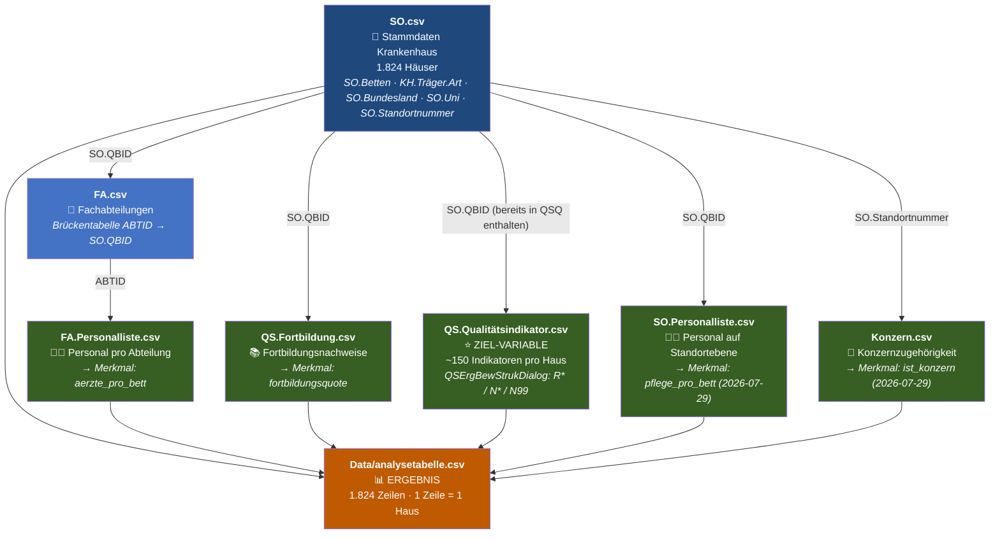

# 📂 Inhaltsverzeichnis — Datensatz Qualitäts-Muster-Finder

| | |
|---|---|
| **Quelle** | Ordner `Data/` im Projektverzeichnis |
| **Herkunft** | Offizielle Qualitätsberichte deutscher Krankenhäuser, 2023, veröffentlicht vom IQTIG (G-BA) |
| **Dateien** | 86 CSV-Dateien · ca. 1,2 GB |
| **Schlüssel** | `SO.QBID` — verbindet fast alle Tabellen (eindeutige Standort-ID) |
| **Häuser** | 2.310 in `SO.csv` (Stammdaten) · 1.824 in `QS.Qualitätsindikator.csv` und in `analysetabelle.csv` (mit Bewertung). Die oft zitierte „~1.900" stammt als grobe Schätzung aus `Fragestellung.docx`, nicht aus einer eigenen Zählung. |

---

## Übersichtstabelle

### Datenart — Erklärung der Kategorien

| Datenart | Bedeutung | Herkunft im Qualitätsbericht |
|----------|-----------|------------------------------|
| **Strukturdaten (A-Teil)** | Beschreibt, **wie ein Krankenhaus aufgebaut ist**: Größe, Personal, Träger, Standort, Ausstattung. Der „A-Teil" ist der erste Hauptabschnitt des offiziellen deutschen Qualitätsberichts — „A" steht für **Allgemeiner Teil**. Diese Daten sind unsere **Merkmale (Features X)** für die Analyse. | Abschnitte A-1 bis A-7 des Qualitätsberichts |
| **Qualitätsdaten (C-Teil)** | Beschreibt, **wie gut die medizinische Versorgung ist**: Qualitätsindikatoren, Bewertungen, Fortbildung. Der „C-Teil" steht für **Qualitätssicherung** — den dritten Hauptteil des Berichts. Diese Daten liefern unsere **Ziel-Variable (y)**. | Abschnitte C-1 bis C-5 des Qualitätsberichts |
| **Verknüpfung** | Enthält **keine eigenen Analysedaten**, sondern verbindet zwei andere Tabellen über gemeinsame IDs (Joins). Ohne diese Tabellen können die Daten nicht zusammengeführt werden. | Technische Hilfstabellen |
| **Lookup** | Reine **Dekodierungstabellen**: übersetzen Codes in lesbare Bezeichnungen (z. B. ICD-Code → Krankheitsname). Kein eigener Analysewert — die eigentlichen Daten stehen in anderen Tabellen. | Schlüsseltabellen / Codelisten |
| **Links** | Enthält nur **URLs zu externen Webseiten** der Krankenhäuser. Keine Zahlenwerte, keine Merkmale, kein Analysewert. | Weiterführende Verweise |

### Relevanz-Legende

| Symbol | Bedeutung |
|--------|-----------|
| ✅ **JA** | Datei wird aktiv in der Analyse verwendet — Spalten sind in `analysetabelle.csv` eingeflossen |
| ⚠️ **Möglicherweise** | Datei wurde identifiziert und enthält potenziell nützliche Daten, aber noch **nicht eingebunden**. Kandidat für Folgeanalysen |
| ❌ **NEIN** | Datei bewusst ausgeschlossen — entweder kein Analysebezug, zu spezifisch, Verwaltungsdaten oder Redundanz mit einer verwendeten Datei |

---

<table>
<colgroup>
<col style="width:10%">
<col style="width:14%">
<col style="width:16%">
<col style="width:22%">
<col style="width:38%">
</colgroup>
<thead><tr><th>Datenart</th><th>Struktur</th><th>Dateiname</th><th>Wichtige Spalten</th><th>Warum</th></tr></thead>
<tbody>
<tr><td colspan="5" style="background:#d4edda;color:#155724;font-weight:bold;text-align:center">✅ JA — 7 Dateien</td></tr>
<tr><td><strong>Strukturdaten (A-Teil)</strong></td><td>Krankenhaus-Stammdaten</td><td><code>SO.csv</code></td><td><code>SO.Betten</code>, <code>KH.Träger.Art</code>, <code>SO.Bundesland</code>, <code>SO.Uni</code>, <code>SO.Latitude/Longitude</code>, <code>SO.QBID</code></td><td>Einzige Datei mit allen Strukturmerkmalen der Aufgabenstellung in einer Tabelle. <code>SO.QBID</code> = Primärschlüssel für alle Joins</td></tr>
<tr><td><strong>Strukturdaten (A-Teil)</strong></td><td>Personal pro Fachabteilung</td><td><code>FA.Personalliste.csv</code></td><td><code>ABTID</code>, <code>FA.Personal.Bereich</code> (Ärzte/Pflege), <code>FA.Personal.Anzahl</code> ⚠️ Komma-Dezimal</td><td>Einzige Quelle für Vollzeit-Ärzteanzahl → <code>aerzte_pro_bett</code>. <strong>Feature Importance 53,6 %</strong> im Decision Tree</td></tr>
<tr><td><strong>Strukturdaten (A-Teil)</strong></td><td>Fortbildungsnachweise</td><td><code>QS.Fortbildung.csv</code></td><td><code>SO.QBID</code>, <code>QS.Fortbildungspflichtige</code>, <code>QS.Fortbildungsnachweis_Erbracht_Habende</code></td><td>Aufgabenstellung nennt Fortbildungsquote explizit → <code>fortbildungsquote = Erbracht / Pflichtige</code></td></tr>
<tr><td><strong>Verknüpfung</strong></td><td>Fachabteilungen (Brückentabelle)</td><td><code>FA.csv</code></td><td><code>ABTID</code>, <code>FA.QBID</code> (= <code>SO.QBID</code>), <code>FA.Name</code>, <code>FA.FZ.Voll</code></td><td>Verbindet <code>ABTID</code> (aus FA.Personalliste) mit <code>SO.QBID</code>. Ohne diese Datei kein Join zwischen Personal und Krankenhaus</td></tr>
<tr><td><strong>Qualitätsdaten (C-Teil)</strong></td><td>Qualitätsindikatoren mit Bewertungen</td><td><code>QS.Qualitätsindikator.csv</code> ⚠️ >50 MB</td><td><code>QSErgBewStrukDialog</code> (R*/N*/N99), <code>QSQI.Indikator</code>, <code>QSQI.ArtDesWertes</code>, <code>SO.QBID</code></td><td><strong>Ziel-Variable.</strong> Einzige standardisierte auffällig-Bewertung (R* = auffällig) für 1.824 Häuser (eindeutige SO.QBID in dieser Datei — nicht die aus der Aufgabenstellung geschätzten „~1.900")</td></tr>
<tr><td><strong>Strukturdaten (A-Teil)</strong></td><td>Konzernzugehörigkeiten</td><td><code>Konzern.csv</code></td><td><code>SO.Standortnummer</code> (⚠️ <strong>nicht</strong> <code>SO.QBID</code>!)</td><td>Merkmal <code>ist_konzern</code>. <strong>2026-07-29 eingebunden</strong> — Join lief ursprünglich fälschlich über <code>SO.QBID</code> (0 Treffer), korrekt ist <code>SO.Standortnummer</code> gegen <code>SO.csv</code>s eigene <code>SO.Standortnummer</code>-Spalte. Ergebnis: 358 von 1.824 Häusern (19,6 %) sind Konzernhäuser — Chi²-Test zeigt aber <strong>keinen</strong> signifikanten Zusammenhang mit Qualitätsproblemen (p=0,90)</td></tr>
<tr><td><strong>Strukturdaten (A-Teil)</strong></td><td>Personal auf Standortebene</td><td><code>SO.Personalliste.csv</code></td><td><code>SO.QBID</code>, <code>SO.Personal.Bereich</code> (u.a. 'Pflege'), <code>SO.Personal.Anzahl</code></td><td><strong>2026-07-29 eingebunden.</strong> Quelle für <code>pflege_pro_bett</code> (Filter <code>SO.Personal.Bereich == 'Pflege'</code>). Bewusst statt <code>AQ.Pflege.csv</code> gewählt, da direkt <code>SO.QBID</code> + Anzahl liefert — kein Umweg über <code>FA.csv</code> nötig. Feature Importance im Decision Tree: <strong>23,8 %</strong></td></tr>
<tr><td colspan="5" style="background:#fff3cd;color:#856404;font-weight:bold;text-align:center">⚠️ Möglicherweise — 33 Dateien</td></tr>
<tr><td><strong>Verknüpfung</strong></td><td>QS-Berichtsbasis</td><td><code>QS.csv</code></td><td><code>SO.QBID</code>, <code>QS.Typ</code> (bund/land), <code>QS.Standortnummer</code></td><td>Wird tatsächlich <strong>nie geladen</strong> — <code>QS.Qualitätsindikator.csv</code> trägt <code>SO.QBID</code> bereits selbst, ein Join über <code>QS.csv</code> ist für die Zusammenführung nicht nötig. <code>QS.Typ</code> (bund/land) könnte aber noch für eine Filterung genutzt werden — bisher nicht geprüft, ob das die Ziel-Variable verzerrt <em>(2026-07-30 korrigiert — stand fälschlich als ✅ JA)</em></td></tr>
<tr><td><strong>Qualitätsdaten (C-Teil)</strong></td><td>Leistungsbereiche / Dokumentationsraten</td><td><code>QS.Leistungsbereich.csv</code></td><td><code>SO.QBID</code>, <code>QSLB.Leistungsbereich</code>, <code>QSLB.Dokumentationsrate</code>, <code>QSLB.Fallzahl</code></td><td><code>QSLB.Dokumentationsrate</code> = potenzielle Qualitätskennzahl. Noch nicht in Analysetabelle eingebunden</td></tr>
<tr><td><strong>Qualitätsdaten (C-Teil)</strong></td><td>Externe QS-Ergebnisse (Zahlen)</td><td><code>QS.Extern.Sonstige.csv</code></td><td><code>Externe.QS.Leistungsbereich</code>, <code>Externe.QS.Ergebnis</code>, <code>SO.QBID</code></td><td>Alternative Ziel-Variable; keine einheitliche auffällig-Bewertung — Überschneidung mit QS.Qualitätsindikator unklar</td></tr>
<tr><td><strong>Qualitätsdaten (C-Teil)</strong></td><td>Behandlungsumfang</td><td><code>QS.Behandlungsumfang.csv</code></td><td><code>SO.QBID</code></td><td>Ergänzung zu QS.Leistungsbereich; noch nicht gesichtet</td></tr>
<tr><td><strong>Strukturdaten (A-Teil)</strong></td><td>Mindestmengen</td><td><code>MM.csv</code></td><td><code>MM.Erbracht</code>, <code>MM.Mindestmenge</code>, <code>MM.Differenz</code>, <code>MM.LB.Kurz</code>, <code>SO.QBID</code></td><td>Strukturmerkmal: Erfüllt ein Haus seine Mindestmengen? Nicht verwendet</td></tr>
<tr><td><strong>Strukturdaten (A-Teil)</strong></td><td>Mindestmengen-Ausnahmen</td><td><code>MM.Ausnahme.csv</code></td><td><code>SO.QBID</code></td><td>Ergänzung zu <code>MM.csv</code></td></tr>
<tr><td><strong>Strukturdaten (A-Teil)</strong></td><td>Mindestmengen-Prognosen</td><td><code>MM.Leistungsberechtigung.Prognose.csv</code></td><td><code>SO.QBID</code></td><td>Ergänzung zu <code>MM.csv</code></td></tr>
<tr><td><strong>Strukturdaten (A-Teil)</strong></td><td>Zertifizierungen</td><td><code>CQ.csv</code></td><td><code>CQ.Key</code>, <code>SO.QBID</code></td><td>Welche Zertifizierungen hat ein Haus? Strukturmerkmal — nicht verwendet</td></tr>
<tr><td><strong>Strukturdaten (A-Teil)</strong></td><td>Ausstattungsmerkmale</td><td><code>AM.csv</code></td><td><code>SO.QBID</code></td><td>Strukturmerkmal; noch nicht gesichtet</td></tr>
<tr><td><strong>Strukturdaten (A-Teil)</strong></td><td>Ausstattung Leistungen</td><td><code>AM.Leistung.csv</code></td><td><code>SO.QBID</code></td><td>Ergänzung zu <code>AM.csv</code></td></tr>
<tr><td><strong>Strukturdaten (A-Teil)</strong></td><td>Ausstattung VAVU</td><td><code>AM.VAVU.csv</code></td><td><code>SO.QBID</code></td><td>Ergänzung zu <code>AM.csv</code></td></tr>
<tr><td><strong>Strukturdaten (A-Teil)</strong></td><td>Behandlungsfelder</td><td><code>BF.csv</code></td><td><code>BF</code>, <code>BF.Erläuterung</code>, <code>BF.Key</code>, <code>SO.QBID</code></td><td>Bedeutung von BF.Key für Analyse unklar</td></tr>
<tr><td><strong>Strukturdaten (A-Teil)</strong></td><td>Behandlungsmöglichkeiten</td><td><code>BM.csv</code></td><td><code>SO.QBID</code></td><td>Strukturmerkmal; noch nicht gesichtet</td></tr>
<tr><td><strong>Strukturdaten (A-Teil)</strong></td><td>Arzneimitteltherapiesicherheit</td><td><code>AMTS.csv</code></td><td><code>SO.QBID</code></td><td>Qualitätsmerkmal; Bedeutung für Auffälligkeitsquote unklar</td></tr>
<tr><td><strong>Strukturdaten (A-Teil)</strong></td><td>AMTS-Maßnahmen</td><td><code>AMTS_Massnahme.csv</code></td><td><code>SO.QBID</code></td><td>Ergänzung zu <code>AMTS.csv</code></td></tr>
<tr><td><strong>Strukturdaten (A-Teil)</strong></td><td>Risikomanagement</td><td><code>RM.csv</code></td><td><code>SO.QBID</code></td><td>Strukturmerkmal; noch nicht gesichtet</td></tr>
<tr><td><strong>Strukturdaten (A-Teil)</strong></td><td>RM Fallbesprechungen</td><td><code>RM.Fallbesprechung.csv</code></td><td><code>SO.QBID</code></td><td>Ergänzung zu <code>RM.csv</code></td></tr>
<tr><td><strong>Strukturdaten (A-Teil)</strong></td><td>Notfallversorgungsstufen</td><td><code>Notfallversorgung.csv</code></td><td><code>SO.QBID</code></td><td>Strukturmerkmal; noch nicht gesichtet</td></tr>
<tr><td><strong>Strukturdaten (A-Teil)</strong></td><td>Mindestpersonalbedarf</td><td><code>MP.csv</code></td><td><code>SO.QBID</code></td><td>Personalstruktur; noch nicht gesichtet</td></tr>
<tr><td><strong>Strukturdaten (A-Teil)</strong></td><td>Hygienedaten Basis</td><td><code>HB.csv</code></td><td><code>SO.QBID</code></td><td>Mögliches Qualitätsmerkmal; noch nicht gesichtet</td></tr>
<tr><td><strong>Strukturdaten (A-Teil)</strong></td><td>Hygienedaten Detail</td><td><code>HD.csv</code> (40 MB)</td><td><code>SO.QBID</code></td><td>Detaillierte Hygienedaten; >50 MB — nicht direkt in VS Code öffenbar</td></tr>
<tr><td><strong>Strukturdaten (A-Teil)</strong></td><td>Hygiene-Maßnahmen</td><td><code>HM.csv</code></td><td><code>SO.QBID</code></td><td>Ergänzung Hygiene</td></tr>
<tr><td><strong>Strukturdaten (A-Teil)</strong></td><td>Weitere Hygienedaten</td><td><code>WeitereHygiene.csv</code></td><td><code>SO.QBID</code></td><td>Ergänzung Hygiene</td></tr>
<tr><td><strong>Strukturdaten (A-Teil)</strong></td><td>KISS-Infektionssurveillance</td><td><code>KISS.csv</code></td><td><code>SO.QBID</code></td><td>Qualitätsmerkmal Infektionen; noch nicht gesichtet</td></tr>
<tr><td><strong>Qualitätsdaten (C-Teil)</strong></td><td>Personalstunden Psychiatrie</td><td><code>QS.Pso.csv</code></td><td><code>QS.Pso.Berufsgruppen</code>, <code>QS.Einrichtung.ID</code></td><td>Nur psychiatrische Einrichtungen — zu spezifisch für allg. Analyse</td></tr>
<tr><td><strong>Qualitätsdaten (C-Teil)</strong></td><td>Stationsstruktur Psychiatrie</td><td><code>QS.Struktur.Station.csv</code></td><td><code>QS.Station.Planbetten</code>, <code>QS.Station.Typ</code></td><td>Nur Psychiatrie-Häuser</td></tr>
<tr><td><strong>Qualitätsdaten (C-Teil)</strong></td><td>Psychiatrie-Qualitätsdaten</td><td><code>QS.Psy.csv</code></td><td><code>SO.QBID</code></td><td>Nur Psychiatrie — zu spezifisch</td></tr>
<tr><td><strong>Strukturdaten (A-Teil)</strong></td><td>Apparative Ausstattung</td><td><code>AA.csv</code></td><td><code>SO.QBID</code>, <code>AA.24.Stunden.Verfügbar</code></td><td>Gehört zur AM-Familie (Geräte-Verfügbarkeit); nicht gesichtet <em>(2026-07-29 nachgetragen)</em></td></tr>
<tr><td><strong>Qualitätsdaten (C-Teil)</strong></td><td>AMTS-Instrument-Maßnahmen</td><td><code>AMTS_InstrumentMassnahme.csv</code></td><td><code>AMTSMassnahme.Key</code></td><td>Detail-/Lookup-Tabelle zu <code>AMTS_Massnahme.csv</code> <em>(2026-07-29 nachgetragen)</em></td></tr>
<tr><td><strong>Strukturdaten (A-Teil)</strong></td><td>Disease-Management-Programme</td><td><code>DMP.csv</code></td><td><code>SO.QBID</code>, <code>DMP.Bezeichnung</code></td><td>Teilnahme an strukturierten Behandlungsprogrammen — potenzielles Strukturmerkmal, nie geprüft <em>(2026-07-29 nachgetragen)</em></td></tr>
<tr><td><strong>Strukturdaten (A-Teil)</strong></td><td>Externe Fachabteilungen</td><td><code>EF.csv</code></td><td><code>SO.QBID</code>, <code>EF.Key</code></td><td>Ausgelagerte/kooperative Abteilungen; nicht gesichtet <em>(2026-07-29 nachgetragen)</em></td></tr>
<tr><td><strong>Strukturdaten (A-Teil)</strong></td><td>Interne Fachabteilungen</td><td><code>IF.csv</code></td><td><code>SO.QBID</code>, <code>IF.Frequenz</code></td><td>Hausinterne Fachabteilungen; nicht gesichtet <em>(2026-07-29 nachgetragen)</em></td></tr>
<tr><td><strong>Strukturdaten (A-Teil)</strong></td><td>Mitbewerber-Bettenzahl</td><td><code>Mitbewerber_Betten.csv</code></td><td><code>Dest.TSOID</code>, <code>Dest.Betten</code></td><td>Bettenzahl benachbarter Wettbewerber — Marktdichte-/Konkurrenzmerkmal, im gesamten Projekt bisher nicht in Betracht gezogen <em>(2026-07-29 nachgetragen)</em></td></tr>
<tr><td colspan="5" style="background:#f2f2f2;color:#555555;font-weight:bold;text-align:center">❌ NEIN — 29 Dateien</td></tr>
<tr><td><strong>Strukturdaten (A-Teil)</strong></td><td>Personaldaten allgemein</td><td><code>Personen.csv</code></td><td>—</td><td>⚠️ DSGVO: personenbezogen. Redundanz mit FA.Personalliste</td></tr>
<tr><td><strong>Strukturdaten (A-Teil)</strong></td><td>Qualifikation Ärzte</td><td><code>AQ.Ärzte.csv</code></td><td><code>SO.QBID</code></td><td>Qualifikationen, keine Anzahlen. <code>FA.Personalliste.csv</code> wurde verwendet</td></tr>
<tr><td><strong>Strukturdaten (A-Teil)</strong></td><td>Qualifikation Pflege</td><td><code>AQ.Pflege.csv</code></td><td><code>SO.QBID</code></td><td>Enthält nur Qualifikationsnachweise, keine Personal-Anzahlen. <code>SO.Personalliste.csv</code> liefert <code>pflege_pro_bett</code> direkter</td></tr>
<tr><td><strong>Strukturdaten (A-Teil)</strong></td><td>Einzelpersonen Fachabteilungen</td><td><code>FA.Personen.csv</code></td><td><code>ABTID</code></td><td>Zu granular; FA.Personalliste.csv wurde verwendet</td></tr>
<tr><td><strong>Strukturdaten (A-Teil)</strong></td><td>Geriatrische Indikatoren</td><td><code>GIQI.csv</code></td><td><code>SO.QBID</code></td><td>Fachspezifisch; keine allg. Relevanz</td></tr>
<tr><td><strong>Strukturdaten (A-Teil)</strong></td><td>VAVU-Daten</td><td><code>VAVU.csv</code> (14 MB)</td><td><code>SO.QBID</code></td><td>Versorgungsstruktur; nicht gesichtet</td></tr>
<tr><td><strong>Strukturdaten (A-Teil)</strong></td><td>Schutzkonzepte</td><td><code>Schutzkonzept.csv</code></td><td><code>SO.QBID</code></td><td>Zu spezifisch</td></tr>
<tr><td><strong>Strukturdaten (A-Teil)</strong></td><td>Prävention Missbrauch</td><td><code>Praevention_Missbrauch_und_Gewalt.csv</code></td><td><code>SO.QBID</code></td><td>Zu spezifisch</td></tr>
<tr><td><strong>Strukturdaten (A-Teil)</strong></td><td>Sicherstellungszuschläge</td><td><code>Sicherstellungszuschlaege.csv</code></td><td><code>SO.QBID</code></td><td>Verwaltungsdaten</td></tr>
<tr><td><strong>Strukturdaten (A-Teil)</strong></td><td>Neuartige Therapien</td><td><code>Neuartige_Therapien.csv</code></td><td><code>SO.QBID</code></td><td>Zu spezifisch</td></tr>
<tr><td><strong>Strukturdaten (A-Teil)</strong></td><td>Akademische Lehre</td><td><code>Akademische_Lehre.csv</code></td><td><code>SO.QBID</code></td><td>Eher Metadaten</td></tr>
<tr><td><strong>Strukturdaten (A-Teil)</strong></td><td>Lenkungsgremien</td><td><code>Lenkungsgremium.csv</code></td><td><code>SO.QBID</code></td><td>Organisationsstruktur; Relevanz unklar</td></tr>
<tr><td><strong>Strukturdaten (A-Teil)</strong></td><td>Zusatzvereinbarungen</td><td><code>ZV.csv</code></td><td><code>SO.QBID</code></td><td>Strukturmerkmal; nicht gesichtet</td></tr>
<tr><td><strong>Strukturdaten (A-Teil)</strong></td><td>Nicht-medizinische Angebote</td><td><code>NM.csv</code></td><td><code>SO.QBID</code></td><td>Parkplatz, Telefon, Ernährung — kein Analysebezug</td></tr>
<tr><td><strong>Strukturdaten (A-Teil)</strong></td><td>Pflegepersonalregelung</td><td><code>Pflegepersonalregelung.csv</code></td><td><code>SO.QBID</code></td><td>Verwaltungsdaten</td></tr>
<tr><td><strong>Strukturdaten (A-Teil)</strong></td><td>Personalvorgaben</td><td><code>ErfPersVorgaben.csv</code></td><td><code>SO.QBID</code></td><td>Verwaltungsdaten</td></tr>
<tr><td><strong>Qualitätsdaten (C-Teil)</strong></td><td>Nachweiszeiträume</td><td><code>QS.Nachweis.csv</code></td><td>—</td><td>Nur technische Meta-Info</td></tr>
<tr><td><strong>Qualitätsdaten (C-Teil)</strong></td><td>Bewertungen Strukturierter Dialog</td><td><code>BewertungStrukDialog.csv</code></td><td>—</td><td>Erläutert QSErgBewStrukDialog; Relevanz unklar</td></tr>
<tr><td><strong>Qualitätsdaten (C-Teil)</strong></td><td>Landesrechtliche QS</td><td><code>QS.Landesrecht.csv</code></td><td>—</td><td>Länderspezifisch; nicht gesichtet</td></tr>
<tr><td><strong>Lookup</strong></td><td>ICD-Diagnoseschlüssel</td><td><code>ICD.Code.csv</code></td><td>—</td><td>Nur Lookup-Tabelle</td></tr>
<tr><td><strong>Lookup</strong></td><td>OPS-Schlüssel</td><td><code>OPS.Code.csv</code>, <code>OPS.csv</code></td><td>—</td><td>Nur Lookup-Tabelle</td></tr>
<tr><td><strong>Lookup</strong></td><td>Einrichtungstypen</td><td><code>QS.Einrichtungstypen.csv</code></td><td>—</td><td>Nur Lookup</td></tr>
<tr><td><strong>Lookup</strong></td><td>Berufsgruppen</td><td><code>QS.Berufsgruppen.csv</code></td><td>—</td><td>Nur Lookup</td></tr>
<tr><td><strong>Lookup</strong></td><td>Alle <code>*.Key.csv</code></td><td><code>AA.Key.csv</code>, <code>AM.Key.csv</code>, <code>AM.VAVU.Key.csv</code>, <code>AQZF.Key.csv</code>, <code>BF.Key.csv</code>, <code>CQ.Key.csv</code>, <code>EF.Key.csv</code>, <code>HM.Key.csv</code>, <code>IF.Key.csv</code>, <code>LK.Key.csv</code>, <code>MM.Key.csv</code>, <code>MP.Key.csv</code>, <code>NM.Key.csv</code>, <code>PQZP.Key.csv</code>, <code>RM.Key.csv</code>, <code>VAVU.Key.csv</code></td><td>—</td><td>Schlüssel-/Lookup-Tabellen ohne Analysedaten</td></tr>
<tr><td><strong>Links</strong></td><td>URL-Links</td><td><code>Link.csv</code>, <code>LinkVersorgunggebieteSO.csv</code>, <code>Weiterführender_Link.csv</code></td><td>—</td><td>Keine Analysedaten</td></tr>
<tr><td><strong>Verknüpfung</strong></td><td>Abteilungs-Zugang (Adressdaten)</td><td><code>Abt.Zugang.csv</code></td><td><code>ABTID</code></td><td>Adress-/Kontaktdaten einer Abteilung, keine Analysedaten <em>(2026-07-29 nachgetragen)</em></td></tr>
<tr><td><strong>Lookup</strong></td><td>Fachabteilungsschlüssel 301</td><td><code>Abt301.csv</code></td><td><code>FA.Key301</code></td><td>Lookup-Tabelle (amtlicher Fachabteilungsschlüssel) <em>(2026-07-29 nachgetragen)</em></td></tr>
<tr><td><strong>Strukturdaten (A-Teil)</strong></td><td>Fehlerprotokoll</td><td><code>Error.csv</code></td><td><code>SO.QBID</code>, <code>Error.Msg</code></td><td>Technisches Fehlerprotokoll der Berichtserstellung, keine Inhaltsdaten <em>(2026-07-29 nachgetragen)</em></td></tr>
<tr><td><strong>Strukturdaten (A-Teil)</strong></td><td>Sicherstellungszuschläge je Fachabteilung</td><td><code>Sicherstellungszuschlaege_Fachabteilungen.csv</code></td><td><code>SO.Standortnummer</code></td><td>Abteilungsdetail zum bereits ausgeschlossenen <code>Sicherstellungszuschlaege.csv</code> — Verwaltungsdaten <em>(2026-07-29 nachgetragen)</em></td></tr>
</tbody>
</table>

---

## 🗺️ Datenmodell — Beziehungen

### Diagramm (Mermaid — wird in VS Code mit Erweiterung gerendert)

> **Hinweis:** `QS.csv` (QS-Berichtsbasis) wurde ursprünglich als notwendige Brückentabelle zwischen `SO.csv` und `QS.Qualitätsindikator.csv` vermutet — daher taucht sie in älteren Versionen dieses Diagramms auf. Tatsächlich wird sie nie geladen: `QS.Qualitätsindikator.csv` trägt `SO.QBID` bereits selbst, ein zusätzlicher Join ist nicht nötig. Siehe Klassifikationstabelle oben (jetzt ⚠️ Möglicherweise statt ✅ JA).

---

### Verbindungen — Join-Schlüssel erklärt

| Von | Join-Schlüssel | Nach | Warum dieser Join? |
|-----|---------------|------|--------------------|
| `SO.csv` | `SO.QBID` | `QS.Qualitätsindikator.csv` | Kein Umweg über `QS.csv` nötig — die Zieldatei trägt `SO.QBID` bereits selbst |
| `SO.csv` | `SO.QBID` | `QS.Fortbildung.csv` | Fortbildungsdaten direkt auf Standortebene verfügbar |
| `SO.csv` | `SO.QBID` | `FA.csv` | Fachabteilungen gehören zu einem Standort |
| `FA.csv` | `ABTID` | `FA.Personalliste.csv` | Personaldaten sind abteilungsweise gespeichert — `FA.csv` liefert die Zuordnung zur Haus-ID |
| `SO.csv` | `SO.QBID` | `SO.Personalliste.csv` *(2026-07-29)* | Personal auf Standortebene, direkt über `SO.QBID` — kein Brücken-Umweg nötig |
| `SO.csv` | `SO.Standortnummer` | `Konzern.csv` *(2026-07-29)* | ⚠️ Nicht `SO.QBID`! `Konzern.csv` nutzt einen anderen Schlüssel — ursprünglicher Bug verglich fälschlich gegen `SO.QBID` (0 Treffer) |

> **Warum der Umweg über FA.csv?**  
> `FA.Personalliste.csv` enthält nur `ABTID` (Abteilungs-ID), aber **nicht** `SO.QBID` (Haus-ID).  
> `FA.csv` ist die einzige Tabelle, die beide Schlüssel hat (`ABTID` + `FA.QBID` = `SO.QBID`).  
> Ohne `FA.csv` kann man die Ärzteanzahl nicht dem richtigen Krankenhaus zuordnen.

---

### Was entsteht: Spalten der analysetabelle.csv

| Spalte | Typ | Quelle | Beschreibung |
|--------|-----|--------|--------------|
| `SO.QBID` | ID | `SO.csv` | Eindeutige Krankenhaus-Standort-ID — Primärschlüssel |
| `SO.Name` | Text | `SO.csv` | Name des Krankenhauses |
| `SO.Betten` | Zahl | `SO.csv` | Bettenzahl — Größenindikator |
| `KH.Träger` | Text | `SO.csv` | Trägername im Klartext (unbereinigt) |
| `KH.Träger.Art` | Kategorie | `SO.csv` | `privat` / `freigemeinnützig` / `öffentlich` |
| `SO.Bundesland` | Kategorie | `SO.csv` | Region (16 Bundesländer) |
| `SO.Uni` | 0/1 | `SO.csv` | Universitätsklinikum ja/nein |
| `SO.Latitude` / `SO.Longitude` | Dezimal | `SO.csv` | Geo-Koordinaten — für die Deutschland-Karte im Dashboard |
| `aerzte_pro_bett` | Dezimal | `FA.Personalliste` + `FA.csv` + `SO.csv` | Vollzeit-Ärzte ÷ Betten — **wichtigstes Merkmal (FI 53,6 %)** |
| `fortbildungsquote` | Dezimal | `QS.Fortbildung.csv` | Erbrachte Fortbildungen ÷ Pflichtige |
| `SO.Standortnummer` | ID | `SO.csv` | Standort-Kennnummer — nur als Join-Hilfsspalte für `ist_konzern`, kein Analysemerkmal |
| `pflege_pro_bett` | Dezimal | `SO.Personalliste.csv` | Pflegekräfte ÷ Betten — **2. wichtigstes Merkmal (FI 23,8 %)**, ergänzt 2026-07-29 |
| `ist_konzern` | 0/1 | `Konzern.csv` + `SO.csv` | 1 = Konzernhaus, 0 = unabhängig — ergänzt 2026-07-29, **kein** signifikanter Zusammenhang mit der Ziel-Variable (Chi² p=0,90, FI 0 %) |
| `auffaellig_n` | Zahl | `QS.Qualitätsindikator.csv` | Anzahl Indikatoren mit R\*-Bewertung |
| `total_qi` | Zahl | `QS.Qualitätsindikator.csv` | Gesamtzahl bewerteter Indikatoren |
| `auffaellig_quote` | Dezimal | berechnet | `auffaellig_n / total_qi` |
| `hat_viele_Probleme` | 0/1 | berechnet | 1 wenn `auffaellig_quote` > Median (76,92 %) — **Ziel-Variable (y)** |

---

## 🔬 Wo und wie wurde die Analyse durchgeführt?

### Analyse-Notebook

**Datei:** `01_Exploration.ipynb` im Projektverzeichnis  
**Sprache:** Python 3 (pandas, numpy)  
**Ausführung:** Jupyter Notebook in VS Code

---

### Analyseschritte im Notebook — Schritt für Schritt

| Abschnitt im Notebook | Was wurde gemacht | Verwendete Dateien | Ergebnis |
|-----------------------|-------------------|---------------------|----------|
| **Datei-Listing** | Alle 86 CSV-Dateien mit Größe aufgelistet | `Data/*.csv` | Übersicht: 86 Dateien · 1,2 GB · größte Datei 911 MB |
| **🔗 Tabellenverbindungen** | Alle CSV-Header eingelesen (`nrows=0`), gemeinsame Spaltennamen gezählt, Datei-Präfix-Logik analysiert | Alle 86 CSVs (nur Header) | `SO.QBID` erscheint in ~60 Dateien → universeller Join-Schlüssel bestätigt |
| **1️⃣ Stammdaten** | `SO.csv` geladen, relevante Spalten ausgewählt, Träger- und Uni-Verteilung geprüft | `SO.csv` | 2.310 Krankenhäuser · 3 Trägerarten · Geo-Koordinaten vorhanden |
| **2️⃣ Qualitätsindikatoren** | Erst nur Header (`nrows=5`), dann vollständige Datei geladen. Bewertungsspalte gesucht und `QSErgBewStrukDialog` als Schlüsselspalte identifiziert. Alle Spalten mit niedriger Kardinalität untersucht. | `QS.Qualitätsindikator.csv` (911 MB) | Bewertungscodes: `R*` = auffällig · `N*` = nicht auffällig · `N99` = nicht bewertet |
| **3️⃣ Ziel-Variable** | Nur echte QI-Zeilen (`QSQI.ArtDesWertes == 'QI'`), N99 ausgeschlossen, Duplikate entfernt, Quote berechnet, Median-Schwelle gesetzt | `QS.Qualitätsindikator.csv` | `hat_viele_Probleme = 1` wenn Quote > Median (76,92 %) |
| **4️⃣ Fortbildungsquote** | Fortbildungsdaten geladen, Quote berechnet: Erbrachte ÷ Pflichtige | `QS.Fortbildung.csv` | `fortbildungsquote` pro Haus verfügbar |
| **5️⃣ Analysetabelle** | Alle Teile per `SO.QBID` zusammengeführt, fehlende Werte geprüft, erste Version gespeichert | `SO.csv` + `QS.Qualitätsindikator.csv` + `QS.Fortbildung.csv` | `analysetabelle.csv` — erste Version |
| **6️⃣ Ärzte pro Bett** | `FA.Personalliste.csv` über `FA.csv` (Brücke) mit `SO.csv` gejoint, Komma-Dezimal konvertiert, Ärzte pro Haus aggregiert, durch Bettenzahl dividiert | `FA.csv` + `FA.Personalliste.csv` + `SO.csv` | `aerzte_pro_bett` in Analysetabelle eingebunden |
| **7️⃣ Pflegekräfte pro Bett** <em>(2026-07-29)</em> | `SO.Personalliste.csv` direkt über `SO.QBID` mit `SO.csv` gejoint, Filter `SO.Personal.Bereich == 'Pflege'`, aggregiert, durch Bettenzahl dividiert | `SO.Personalliste.csv` + `SO.csv` | `pflege_pro_bett` in Analysetabelle eingebunden |
| **8️⃣ Konzernzugehörigkeit** <em>(2026-07-29)</em> | `Konzern.csv` über `SO.Standortnummer` mit `SO.csv`s eigener `SO.Standortnummer`-Spalte gejoint (Bugfix: ursprünglich fälschlich gegen `SO.QBID` verglichen → 0 Treffer) | `Konzern.csv` + `SO.csv` | `ist_konzern` in Analysetabelle eingebunden — 358 von 1.824 Häusern (19,6 %) |
| **9️⃣ Analysetabelle aktualisieren** <em>(2026-07-29)</em> | `pflege_pro_bett` und `ist_konzern` in bestehende `Data/analysetabelle.csv` gemergt | — | Analysetabelle jetzt 18 Spalten statt 15 |

---

### Schlüsse aus der Analyse

| Schluss | Belegt durch | Bedeutung |
|---------|-------------|-----------|
| **`SO.QBID` ist der universelle Schlüssel** | Tabellenverbindungs-Analyse: Spalte kommt in ~60 von 86 Dateien vor | Alle Tabellen können über eine einzige ID verknüpft werden |
| **`QSErgBewStrukDialog` ist die Ziel-Spalte** | Exploration Schritt 2: einzige Spalte mit standardisierter R\*/N\*-Bewertung für alle Häuser | Ohne diese Spalte keine vergleichbare Ziel-Variable möglich |
| **N99 muss ausgeschlossen werden** | Schritt 3: N99 = nicht bewertet — ist nicht gleich „nicht auffällig" | Falsche Einbeziehung würde die Quote systematisch verfälschen |
| **Duplikate müssen entfernt werden** | Schritt 3: `QSQI.AEKey` ist eine Haus-ID, kein Indikator-Schlüssel → Deduplizierung über `(SO.QBID, QSQI.Indikator)` | Ohne Deduplizierung werden einzelne Indikatoren mehrfach gezählt |
| **Komma-Dezimal in `FA.Personal.Anzahl`** | Schritt 6: Wert `"13,47"` statt `13.47` — muss vor Aggregation konvertiert werden | Ohne Konvertierung werden Summen falsch berechnet (String statt Float) |
| **`aerzte_pro_bett` = wichtigster Prädiktor** | Ergebnis Decision Tree: Feature Importance **53,6 %** (gefolgt von `pflege_pro_bett` 23,8 % und `SO.Betten` 22,6 %) | Größter Erklärungsbeitrag für `hat_viele_Probleme` im Modell |
| **Tageskliniken bekommen NaN bei aerzte_pro_bett** | Schritt 6: `SO.Betten == 0` → Division durch 0 → NaN | Korrekt: Tageskliniken haben kein stationäres Bettenprofil |
| **Median der auffällig-Quote liegt bei 76,92 %** | Schritt 3: `auffaellig_quote.median()` | Überraschend hoch — bedeutet: typisches Haus hat ~77 % seiner Indikatoren im auffälligen Bereich |

---

## 📌 Wichtige Erkenntnisse

| # | Erkenntnis |
|---|-----------|
| 1 | `SO.QBID` ist der universelle Schlüssel — alle Tabellen über diese ID verknüpfbar |
| 2 | `QS.Qualitätsindikator.csv` ist >50 MB — muss mit `pd.read_csv()` in Python geladen werden |
| 3 | `FA.Personal.Anzahl` verwendet Komma als Dezimalzeichen (`"13,47"`) — muss konvertiert werden |
| 4 | `aerzte_pro_bett` = wichtigster Prädiktor (Decision Tree Feature Importance **53,6 %**) |
| 5 | Ziel-Variable: `auffaellig_quote = R*-Indikatoren / Gesamt-Indikatoren` pro Haus |
| 6 | Träger-Kategorien in `SO.csv` → `KH.Träger.Art`: `privat` \| `freigemeinnützig` \| `öffentlich` |

---

## ⚠️ DSGVO-Hinweis

| Datei | Art der Daten | Maßnahme |
|-------|--------------|----------|
| `Personen.csv` | Vorname, Nachname, E-Mail, Telefon (Kontaktpersonen) | Nicht in Analyse; `Data/` per `.gitignore` ausgeschlossen |
| `FA.Personen.csv` | Vorname, Nachname, E-Mail (ärztl. Leitungen) | Nicht in Analyse; `Data/` per `.gitignore` ausgeschlossen |

---

## 📖 Glossar — Spalten- und Datei-Abkürzungen

### Datei-Präfixe (vor dem Punkt im Dateinamen)

| Präfix | Ausgeschrieben | Bedeutung |
|--------|---------------|-----------|
| `SO` | Standort | Stammdaten eines Krankenhaus-Standorts |
| `QS` | Qualitätssicherung | Daten aus dem C-Teil des Qualitätsberichts (Qualitätsindikatoren, Fortbildung, Leistungsbereiche) |
| `FA` | Fachabteilung | Daten zu den medizinischen Abteilungen eines Hauses |
| `MM` | Mindestmengen | Gesetzliche Mindestfallzahlen für bestimmte Eingriffe |
| `AM` | Ausstattungsmerkmale | Medizinisch-technische Geräte und Ausstattung |
| `AQ` | Ärztliche Qualifikation | Qualifikationsnachweise des ärztlichen Personals |
| `RM` | Risikomanagement | Systeme zur Vermeidung medizinischer Fehler |
| `BF` | Behandlungsfelder | Kategorisierung der Behandlungsschwerpunkte |
| `BM` | Behandlungsmöglichkeiten | Angebotene Behandlungen und Therapien |
| `CQ` | Strukturqualität / Zertifizierungen | Zertifizierungen und Strukturqualitätsvereinbarungen |
| `HB` | Hygiene Basis | Basishygienedaten des Krankenhauses |
| `HD` | Hygiene Detail | Detaillierte Hygienedaten |
| `HM` | Hygiene Maßnahmen | Konkrete Hygienemaßnahmen |
| `NM` | Nicht-medizinische Angebote | Serviceangebote (Parkplatz, WLAN, Cafeteria …) |
| `MP` | Mindestpersonalbedarf | Gesetzliche Personaluntergrenzen |
| `AA` | Apparative Ausstattung | Medizinische Geräte (MRT, CT …) |
| `EF` | Externe Fachabteilungen | Ausgelagerte oder kooperative Abteilungen |
| `IF` | Interne Fachabteilungen | Hausinterne Fachabteilungen |
| `DMP` | Disease-Management-Programme | Strukturierte Behandlungsprogramme für chronische Krankheiten |
| `ZV` | Zusatzvereinbarungen | Spezielle Versorgungsverträge mit Krankenkassen |
| `KH` | Krankenhaus | Übergeordnete Krankenhaus-Informationen (z. B. `KH.Träger.Art`) |
| `AMTS` | Arzneimitteltherapiesicherheit | Maßnahmen zur sicheren Medikamentengabe |
| `GIQI` | Geriatrische Indikatoren | Qualitätsindikatoren speziell für geriatrische Stationen |
| `VAVU` | Versorgungsauftrag / Versorgungsumfang | Leistungsvereinbarungen mit Kostenträgern |
| `KISS` | Krankenhaus-Infektions-Surveillance-System | Erfassung nosokomialer (im Krankenhaus erworbener) Infektionen |

---

### Spalten-Abkürzungen (nach dem Punkt)

| Abkürzung | Ausgeschrieben | Vorkommen |
|-----------|---------------|-----------|
| `QBID` | Qualitätsbericht-ID | `SO.QBID` — eindeutige Standort-ID im Qualitätsbericht |
| `ABTID` | Abteilungs-ID | `FA.csv`, `FA.Personalliste.csv` — eindeutige ID einer Fachabteilung |
| `QI` | Qualitätsindikator | `QSQI.ArtDesWertes == 'QI'` — Werttyp in QS.Qualitätsindikator.csv |
| `QSQI` | QS-Qualitätsindikator | Spalten-Präfix in `QS.Qualitätsindikator.csv` (z. B. `QSQI.Indikator`) |
| `QSLB` | QS-Leistungsbereich | Spalten-Präfix in `QS.Leistungsbereich.csv` (z. B. `QSLB.Dokumentationsrate`) |
| `FZ` | Fallzahl / Vollzeit | `FA.FZ.Voll` = Vollzeitstellen; in anderen Kontexten = Fallzahl |
| `Voll` | Vollzeit | `FA.FZ.Voll` — Vollzeitäquivalente |
| `Teil` | Teilzeit | `FA.FZ.Teil` — Teilzeitäquivalente |
| `Uni` | Universitätsklinikum | `SO.Uni` — 1 = Universitätsklinik, 0 = sonstiges Krankenhaus |

---

### Bewertungscodes — QSErgBewStrukDialog

| Code | Bedeutung |
|------|-----------|
| `R*` (R10, R20, R30 …) | **Rechnerisch auffällig** — Wert liegt außerhalb des Referenzbereichs → Signal für mögliches Qualitätsproblem |
| `N*` (N01, N02 …) | **Nicht auffällig** — Wert liegt innerhalb des Referenzbereichs |
| `N99` | **Nicht bewertet** — z. B. zu wenig Fälle, Indikator nicht anwendbar → wird in der Analyse **ausgeschlossen** |

---

### Institutionen & Fachbegriffe

| Abkürzung | Ausgeschrieben | Bedeutung |
|-----------|---------------|-----------|
| `IQTIG` | Institut für Qualitätssicherung und Transparenz im Gesundheitswesen | Erstellt und veröffentlicht die Qualitätsberichte im Auftrag des G-BA |
| `G-BA` | Gemeinsamer Bundesausschuss | Oberstes Beschlussgremium der gemeinsamen Selbstverwaltung im deutschen Gesundheitswesen |
| `ICD` | International Classification of Diseases | Internationales Diagnoseschlüsselsystem (ICD-10 in Deutschland) |
| `OPS` | Operationen- und Prozedurenschlüssel | Deutsches Klassifikationssystem für medizinische Prozeduren |
| `QI` | Qualitätsindikator | Messgröße zur Beurteilung der Versorgungsqualität |
| `Strukturierter Dialog` | — | Prüfverfahren nach einer R\*-Bewertung — klärt ob wirklich ein Qualitätsproblem vorliegt |
| `A-Teil` | Allgemeiner Teil | Erster Hauptteil des Qualitätsberichts — enthält Strukturdaten des Hauses |
| `C-Teil` | Qualitätssicherungsteil | Dritter Hauptteil des Qualitätsberichts — enthält Qualitätsindikatoren und Bewertungen |
| `C-1.2` | Abschnitt C-1.2 | Abschnitt im C-Teil mit den Qualitätsindikatoren (Quelle der Ziel-Variable) |

---

*Zuletzt aktualisiert: 2026-07-29*

