# QS.Qualitätsindikator.csv — Dokumentation & Analyserolle

## 1. Datei-Übersicht

| Eigenschaft | Wert |
|-------------|------|
| Dateipfad | `Data/CSV/QS.Qualitätsindikator.csv` |
| Dateigröße | **911,7 MB** (größte Datei im Datensatz) |
| Spaltenanzahl | 29 |
| Herkunft | IQTIG im Auftrag des G-BA (Gemeinsamer Bundesausschuss) |
| Erhebungsprinzip | Gesetzlich vorgeschriebene, für alle ~1.900 Häuser einheitliche Qualitätsbewertung |

---

## 2. Spaltenstruktur

### Schlüsselspalten

| Spaltenname | Typ | Bedeutung |
|-------------|-----|-----------|
| `SO.QBID` | String | Krankenhaus-ID — universeller Join-Schlüssel (verbindet mit `SO.csv`, `QS.csv` etc.) |
| `QSQI.Indikator` | String | Indikator-Schlüssel (z. B. `"55857"`) — identifiziert den konkreten Qualitätsindikator |
| `QSErgBewStrukDialog` | String | **Bewertungsspalte** — `R*` = rechnerisch auffällig, `N*` = nicht auffällig, `N99` = nicht bewertet |
| `QSQI.ArtDesWertes` | String | Typ des Eintrags: `QI` = echter Qualitätsindikator, `EKez`/`TKez`/`KKez` = Zählkennzahlen |

### Weitere relevante Spalten

| Spaltenname | Bedeutung |
|-------------|-----------|
| `QSQI.AEKey` | Hauskennung (Auswertungseinheit-Schlüssel) — **kein Indikatorschlüssel** |
| `QSQI.Leistungsbereich` | Medizinischer Leistungsbereich (z. B. Herzchirurgie) |
| `QSQI.Ergebnis` | Numerisches Ergebnis des Indikators |
| `QSQI.Bundesdurchschnitt` | Bundesdurchschnittswert zum Vergleich |
| `QSQI.BundVertrauensbereich` | Konfidenzintervall des Bundesdurchschnitts |
| `QSQI.FallzahlBeobachteteEreignisse` | Beobachtete Fallzahl |
| `QSQI.FallzahlErwarteteEreignisse` | Erwartete Fallzahl (risikoadjustiert) |
| `QSQI.FallzahlGrundgesamtheit` | Gesamtzahl der Fälle im Haus |
| `QSQI.RisikoadjustierteRate` | Risikoadjustierte Rate zum Vergleich |
| `QSQI.KommentarKrankenhaus` | Stellungnahme des Krankenhauses |
| `QSQI.FachlicherHinweisIQTIG` | Fachlicher Kommentar des IQTIG |

### Bewertungscodes in `QSErgBewStrukDialog`

| Code-Muster | Bedeutung |
|-------------|-----------|
| `R10`, `R20`, … | Rechnerisch **auffällig** (R* = Rote Ampel) |
| `N01`, `N02`, … | **Nicht auffällig** (N* = Grüne Ampel) |
| `N99` | **Nicht bewertet** — Grund in den Rohdaten nicht dokumentiert; ≠ "nicht auffällig"! |

### Verknüpfungen zu anderen Dateien

| Join-Schlüssel | Verbindet mit | Vorkommen |
|----------------|---------------|-----------|
| `SO.QBID` | `SO.csv` (Haupttabelle Krankenhäuser) | universell in ~86 Dateien |
| `QS.ID` | `QS.csv` (QS-Berichtsübersicht) | 2 Dateien |
| `QSErgBewStrukDialog` | `BewertungStrukDialog.csv` | 2 Dateien |

---

## 3. Rolle in der Gesamtanalyse

`QS.Qualitätsindikator.csv` ist die **einzige Quelle** im gesamten Projekt, die eine für alle Häuser **einheitlich erhobene, standardisierte Qualitätsaussage** enthält. Ohne diese Datei gibt es keine Ziel-Variable und damit keine Analyse.

```
QS.Qualitätsindikator.csv
        │
        ▼
  Ziel-Variable (y)
  "hat_viele_Probleme"
        │
        ├──► 01_Exploration.ipynb  →  Konstruktion & Speicherung in analysetabelle.csv
        ├──► 02_Analyse.ipynb      →  Deskriptive Analyse & Inferenzstatistik
        └──► 03_Decision_Tree.ipynb →  Machine-Learning-Modell
```

---

## 4. Verwendung in Notebook 01 — `01_Exploration.ipynb`

### 4.1 Erwähnung in Überblick (Zelle 1 — Markdown)
Die Datei wird im Projektziel-Abschnitt als Kernquelle für die Ziel-Variable benannt:
> *"2. `QS.Qualitätsindikator.csv` explorieren → Ziel-Variable bauen"*

### 4.2 Größenabschätzung (Zelle 2 — Dateiliste)
Bei der Auflistung aller CSV-Dateien wird die Dateigröße ausgegeben:
```
QS.Qualitätsindikator.csv   911.7 MB
```

### 4.3 Join-Schlüssel-Analyse (Zelle 4 — Header-Scan)
Durch das Einlesen aller Datei-Header (`nrows=0`) wird erkannt:
- `QSErgBewStrukDialog` kommt in **2 Dateien** vor (`BewertungStrukDialog.csv`, `QS.Qualitätsindikator.csv`)
- `QS.ID` kommt in **2 Dateien** vor → verbindet `QS.csv` mit `QS.Qualitätsindikator.csv`

### 4.4 Präfix-Analyse (Zelle 5)
Identifiziert, dass Spalten mit dem Präfix `QSQI.` nur in `QS.Qualitätsindikator.csv` vorkommen — diese Datei ist thematisch isoliert.

### 4.5 Struktur-Exploration (Zellen 12–14 — Schritt 2)
Wegen der 911-MB-Größe wird die Datei zunächst mit `nrows=5` eingelesen:
```python
qi_head = pd.read_csv(qi_pfad, nrows=5, low_memory=False)
```
Anschließend vollständig:
```python
qi = pd.read_csv(qi_pfad, low_memory=False)
```
Ergebnisse der Exploration:
- 29 Spalten identifiziert
- Bewertungsspalte `QSErgBewStrukDialog` mit Werten `R10`, `R20`, `N01`, `N02`, `N99` lokalisiert
- Typspalte `QSQI.ArtDesWertes` mit Werten `QI`, `EKez`, `TKez`, `KKez` identifiziert

### 4.6 Konstruktion der Ziel-Variable (Zellen 18–19 — Schritt 3)

Dies ist der **zentrale Verarbeitungsschritt** des gesamten Projekts:

```python
# Schritt 1: Nur echte QI-Zeilen (keine Zählkennzahlen)
qi_qi = qi[qi["QSQI.ArtDesWertes"] == "QI"].copy()

# Schritt 2: Nicht bewertete Indikatoren ausschließen
qi_bewertet = qi_qi[qi_qi["QSErgBewStrukDialog"] != "N99"].copy()

# Schritt 3: Deduplizierung — je (Haus + Indikator) eine Zeile
qi_dedup = qi_bewertet.drop_duplicates(subset=["SO.QBID", "QSQI.Indikator"])

# Schritt 4: Auffällig-Flag (R* = rechnerisch auffällig)
qi_dedup["ist_auffaellig"] = qi_dedup["QSErgBewStrukDialog"].str.startswith("R")

# Schritt 5: Quote pro Haus aggregieren
auffaellig_quote = qi_dedup.groupby("SO.QBID").agg(
    total_qi     = ("QSQI.Indikator", "count"),
    auffaellig_n = ("ist_auffaellig", "sum")
).reset_index()
auffaellig_quote["auffaellig_quote"] = auffaellig_quote["auffaellig_n"] / auffaellig_quote["total_qi"]

# Schritt 6: Binäre Ziel-Variable über Median-Schwelle
median_quote = auffaellig_quote["auffaellig_quote"].median()   # ≈ 0.7692 (77 %)
auffaellig_quote["hat_viele_Probleme"] = (auffaellig_quote["auffaellig_quote"] > median_quote).astype(int)
```

**Designentscheidungen und ihre Begründung:**

| Entscheidung | Begründung |
|--------------|------------|
| Nur `QSQI.ArtDesWertes == 'QI'` | `EKez`, `TKez`, `KKez` sind Zählkennzahlen, keine echten Qualitätsindikatoren — würden die Quote verzerren |
| `N99` ausschließen | Bedeutet „nicht bewertet" (Grund in den Rohdaten nicht dokumentiert), nicht „unauffällig" — sonst würden Häuser mit vielen N99-Indikatoren künstlich besser bewertet |
| Deduplizierung über `(SO.QBID, QSQI.Indikator)` | Verhindert Mehrfachzählung desselben Indikators pro Haus |
| Median als Schwelle | Robuster gegen Ausreißer; teilt die ~1.900 Häuser in zwei gleich große Gruppen |

**Ergebnisse der Ziel-Variable:**
- Median der auffällig-Quote: **~77 %** (überraschend hoch — typische Häuser haben ~77 % ihrer Indikatoren im roten Bereich)
- Verteilung: annähernd **925 vs. 899** (Wenige Probleme vs. Viele Probleme)
- Basis: **1.824 Krankenhäuser**

### 4.7 Beitrag zur Analysetabelle (Zellen 23–24 — Schritt 5)
Die aus `QS.Qualitätsindikator.csv` abgeleiteten Spalten bilden die **Basis der Analysetabelle**:
```python
analyse = auffaellig_quote.merge(so_klein, on="SO.QBID", how="left")
                          .merge(fb_quote,  on="SO.QBID", how="left")
```
Beigesteuerte Spalten in `analysetabelle.csv`:
- `SO.QBID` — Krankenhaus-ID
- `total_qi` — Anzahl bewerteter Qualitätsindikatoren pro Haus
- `auffaellig_n` — Anzahl auffälliger Indikatoren
- `auffaellig_quote` — Anteil auffälliger Indikatoren (0–1)
- `hat_viele_Probleme` — **Binäre Ziel-Variable** (0 = wenige, 1 = viele Probleme)

---

## 5. Verwendung in Notebook 02 — `02_Analyse.ipynb`

In diesem Notebook wird `QS.Qualitätsindikator.csv` **nicht direkt geladen**. Stattdessen werden die in Schritt 01 abgeleiteten Spalten aus `analysetabelle.csv` verwendet.

### Direkt genutzte abgeleitete Spalten

| Spalte | Herkunft | Verwendung in 02_Analyse |
|--------|----------|--------------------------|
| `auffaellig_quote` | QS.Qualitätsindikator | Grafik 1: Verteilungshistogramm |
| `hat_viele_Probleme` | QS.Qualitätsindikator | **Gruppierungsmerkmal in allen Grafiken 2–12** |
| `total_qi` | QS.Qualitätsindikator | Grafik 8: Korrelationsmatrix (`r = −0.28` mit `hat_viele_Probleme`) |

### Grafiken mit direktem QS.Qualitätsindikator-Bezug

| Grafik | Beschreibung | QS.Qualitätsindikator-Spalte |
|--------|--------------|------------------------------|
| **Grafik 1** | Verteilung der auffällig-Quote (Histogramm) | `auffaellig_quote` |
| **Grafik 2** | Bettenzahl MIT vs. OHNE viele Probleme (Boxplot) | `hat_viele_Probleme` |
| **Grafik 3** | Trägerschaft — Anteil Viele Probleme (Balken) | `hat_viele_Probleme` |
| **Grafik 4** | Uni-Kliniken vs. normale Häuser | `hat_viele_Probleme` |
| **Grafik 5+6** | Fortbildungsquote & Ärzte/Bett MIT vs. OHNE | `hat_viele_Probleme` |
| **Grafik 7** | Bundesland — Anteil Viele Probleme | `hat_viele_Probleme` |
| **Grafik 8** | Korrelationsmatrix (inkl. `auffaellig_quote`) | `auffaellig_quote`, `hat_viele_Probleme`, `total_qi` |
| **Grafik 9** | Scatter: Bettenzahl vs. Ärzte/Bett (eingefärbt) | `hat_viele_Probleme` |
| **Grafik 10** | Störfaktor: Bettengröße je Trägerschaft | `hat_viele_Probleme` |
| **Grafik 11** | Pflegekräfte/Bett MIT vs. OHNE | `hat_viele_Probleme` |
| **Grafik 12** | Konzernhaus vs. unabhängiges Haus | `hat_viele_Probleme` |

---

**Grafik 1 — Verteilung der auffällig-Quote**

> **Aus QS.Qualitätsindikator:** Pro Haus wurde aus den Rohdaten die `auffaellig_quote` berechnet (Anteil der Indikatoren mit `QSErgBewStrukDialog` = `R*`). Diese kontinuierliche Quote (0–1) ist direkt die X-Achse des Histogramms. Die vertikale gestrichelte Linie markiert den Median (~77 %), der auch als Schwelle für `hat_viele_Probleme` dient.

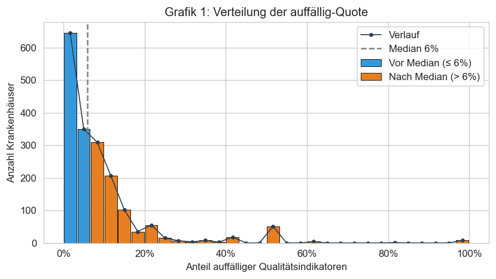

---

**Grafik 2 — Bettenzahl MIT vs. OHNE viele Probleme**

> **Aus QS.Qualitätsindikator:** `hat_viele_Probleme` (0/1) teilt die Krankenhäuser in zwei Gruppen. Die Bettenzahl (`SO.Betten`) stammt aus `SO.csv` — QS.Qualitätsindikator liefert hier ausschließlich die **Gruppeneinteilung**. Ziel: Sind Häuser mit vielen Problemen systematisch kleiner?

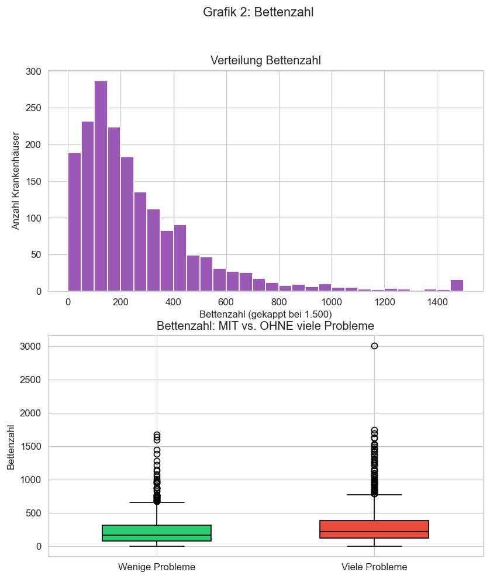

---

**Grafik 3 — Trägerschaft: Anteil Viele Probleme**

> **Aus QS.Qualitätsindikator:** `hat_viele_Probleme` ist die Zählgröße — pro Trägerart wird der Anteil der Häuser mit Wert = 1 als Balken dargestellt. Die Trägerart selbst kommt aus `SO.csv` (`KH.Träger.Art`). Ergebnis: Private Träger haben mit 56,5 % den höchsten Anteil.

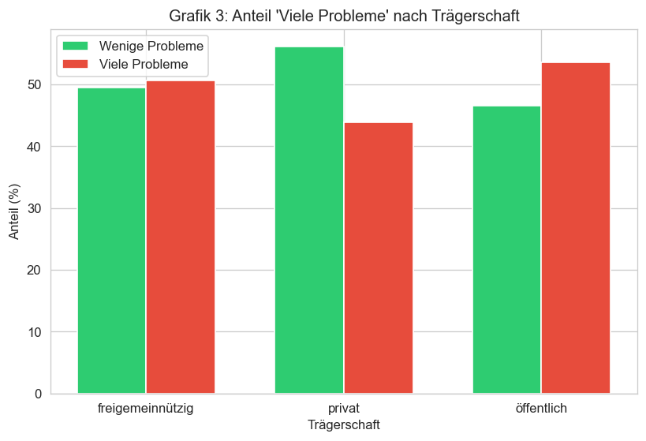

---

**Grafik 4 — Uni-Kliniken vs. normale Häuser**

> **Aus QS.Qualitätsindikator:** `hat_viele_Probleme` bestimmt die Balkenhöhe (Anteil je Gruppe). Der Uni-Status (`SO.Uni`) kommt aus `SO.csv`. Ergebnis: Kein nennenswerter Unterschied (47,3 % vs. 49,4 %).

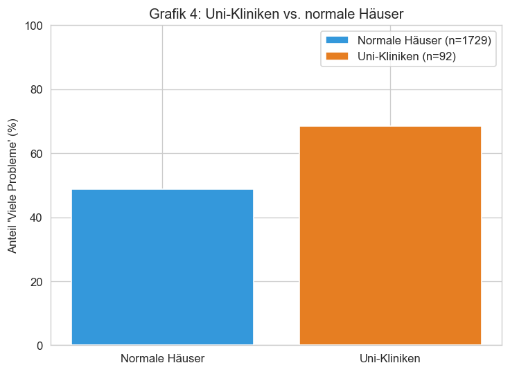

---

**Grafik 5+6 — Fortbildungsquote & Ärzte pro Bett MIT vs. OHNE**

> **Aus QS.Qualitätsindikator:** `hat_viele_Probleme` definiert die beiden Boxplot-Gruppen (grün = wenige, rot = viele Probleme). Die eigentlichen Messwerte (Fortbildungsquote, Ärzte/Bett) kommen aus anderen Quellen — QS.Qualitätsindikator liefert die **Vergleichsachse**. Ärzte/Bett zeigt einen klaren Unterschied (Md: 0,468 vs. 0,390).

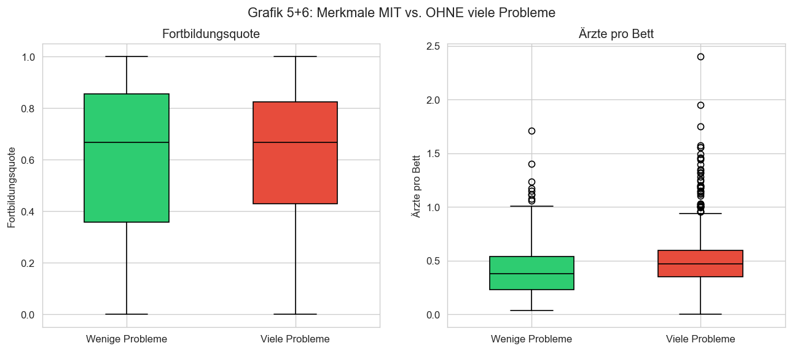

---

**Grafik 7 — Bundesland: Anteil Viele Probleme**

> **Aus QS.Qualitätsindikator:** Pro Bundesland wird der Anteil der Häuser mit `hat_viele_Probleme` = 1 als horizontaler Balken dargestellt. Das Bundesland (`SO.Bundesland`) stammt aus `SO.csv`. Rot = über 50 %, grün = unter 50 %. Höchster Wert: Saarland (63,2 %, n=19).

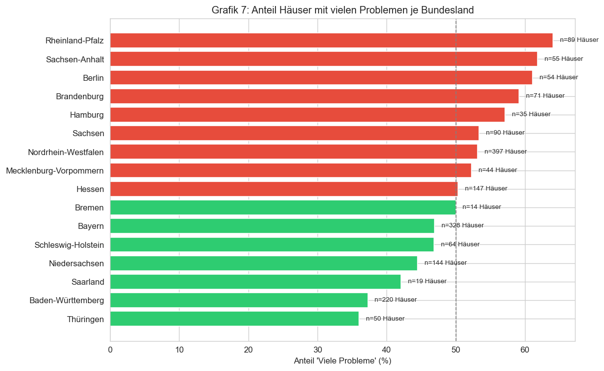

---

**Grafik 8 — Korrelationsmatrix**

> **Aus QS.Qualitätsindikator:** Gleich **drei Spalten** in der Matrix stammen direkt aus dieser Datei: `auffaellig_quote` (r = +0,77 mit Ziel-Variable — konstruktionsbedingt stark), `hat_viele_Probleme` (Ziel-Variable selbst) und `total_qi` (Anzahl bewerteter Indikatoren pro Haus, r = −0,28). Die übrigen Spalten kommen aus anderen Quellen.

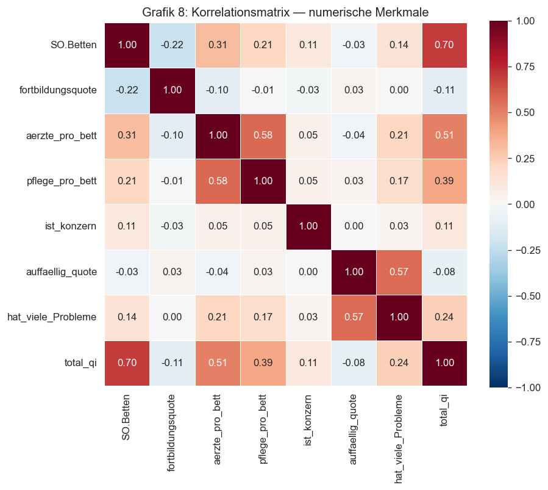

---

**Grafik 9 — Scatter: Bettenzahl vs. Ärzte pro Bett**

> **Aus QS.Qualitätsindikator:** Jeder Punkt ist ein Krankenhaus, eingefärbt nach `hat_viele_Probleme` (grün/rot). Beide Achsen (Betten, Ärzte/Bett) kommen aus anderen Quellen — QS.Qualitätsindikator liefert die **Farbe** = die Qualitätseinstufung jedes Hauses.

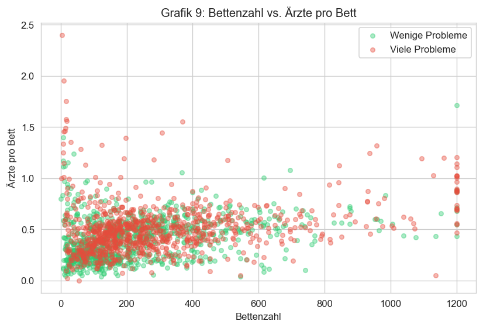

---

**Grafik 10 — Störfaktor: Bettengröße je Trägerschaft**

> **Aus QS.Qualitätsindikator:** Indirekte Rolle — diese Grafik prüft, ob der Trägereffekt (Grafik 3) durch Hausgrößenunterschiede konfundiert ist. `hat_viele_Probleme` ist hier nicht direkt eingezeichnet, aber der Befund aus Grafik 3 (privat = mehr Probleme) muss vor diesem Hintergrund interpretiert werden.

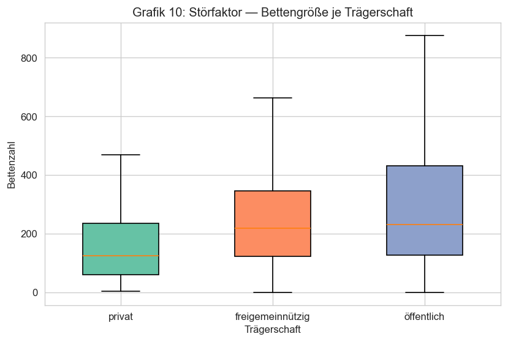

---

**Grafik 11 — Pflegekräfte pro Bett MIT vs. OHNE**

> **Aus QS.Qualitätsindikator:** Wie Grafik 5+6 — `hat_viele_Probleme` definiert die zwei Boxplot-Gruppen. Pflegekräfte/Bett stammt aus `SO.Personalliste.csv`. Ergebnis: Häuser mit weniger Pflegepersonal pro Bett haben tendenziell mehr Qualitätsprobleme (T-Test signifikant).

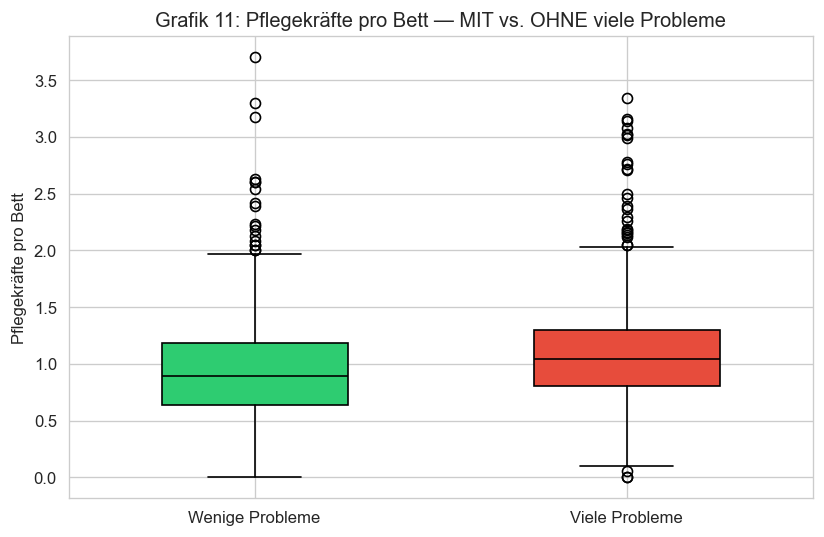

---

**Grafik 12 — Konzernhaus vs. unabhängiges Haus**

> **Aus QS.Qualitätsindikator:** `hat_viele_Probleme` bestimmt die Balkenhöhe pro Gruppe. Konzernzugehörigkeit kommt aus `Konzern.csv`. Ergebnis: Praktisch kein Unterschied — Chi²-Test nicht signifikant. QS.Qualitätsindikator zeigt hier, dass Konzernstruktur kein Qualitätsprädiktor ist.

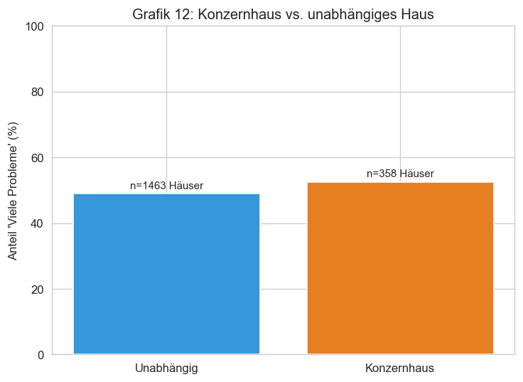

### Inferenzstatistik mit QS.Qualitätsindikator-Bezug

| Test | Gruppen | Ergebnis |
|------|---------|----------|
| **T-Test** | Ärzte/Bett: Wenige vs. Viele Probleme (`hat_viele_Probleme`) | Signifikant (p < 0,05) |
| **T-Test** | Pflege/Bett: Wenige vs. Viele Probleme (`hat_viele_Probleme`) | Signifikant (p < 0,05) |
| **Chi²-Test** | Konzernzugehörigkeit vs. `hat_viele_Probleme` | Nicht signifikant |
| **ANOVA** | `auffaellig_quote` nach Trägerschaft (3 Gruppen) | Signifikant (p < 0,05) |
| **Konfidenzintervalle** | 95%-KI der Ärzte/Bett-Mittelwerte je Gruppe | Getrennte Intervalle |

### Kernbefunde aus 02_Analyse (bezogen auf Ziel-Variable)

| Merkmal | Richtung | Stärke (Korrelation r) |
|---------|----------|------------------------|
| `auffaellig_quote` → `hat_viele_Probleme` | positiv | **+0,77** (sehr stark, konstruktionsbedingt) |
| `total_qi` → `hat_viele_Probleme` | negativ | **−0,28** (moderat) |
| `aerzte_pro_bett` → `hat_viele_Probleme` | negativ | **−0,14** (schwach) |
| `SO.Betten` → `hat_viele_Probleme` | negativ | **−0,08** (sehr schwach) |
| `fortbildungsquote` → `hat_viele_Probleme` | — | **≈0,01** (kein Zusammenhang) |
| Private Trägerschaft → `hat_viele_Probleme` | positiv | **56,5 %** vs. 46 % (moderat) |
| Uni-Status → `hat_viele_Probleme` | — | **kein Unterschied** |

**Auffällig-Quote Verteilung:**
- Median: **77 %** (die meisten Häuser haben mehr als die Hälfte der Indikatoren im roten Bereich)
- Verteilung: **linkssteil** — sehr wenige Häuser haben eine niedrige Auffälligkeitsrate
- Interpretation: Häuser mit mehr Ärzten/Bett und mehr Qualitätsindikatoren insgesamt (größere Häuser) haben tendenziell weniger Probleme

---

## 6. Verwendung in Notebook 03 — `03_Decision_Tree.ipynb`

Auch hier wird `QS.Qualitätsindikator.csv` **nicht direkt geladen** — die Datenbasis ist wieder `analysetabelle.csv`.

### Rolle der abgeleiteten Spalten

| Spalte | Rolle im Modell |
|--------|-----------------|
| `hat_viele_Probleme` | **Ziel-Variable (y)** für den Decision Tree Classifier |
| `auffaellig_quote` | **Ziel-Variable (y)** für die Lineare Regression (R²-Analyse) |

### Modellierung

```python
# Ziel-Variable: hat_viele_Probleme (aus QS.Qualitätsindikator abgeleitet)
X, y = modell.prepare(df)   # y = df["hat_viele_Probleme"]

# Train/Test-Split (80/20, stratifiziert)
X_train, X_test, y_train, y_test = train_test_split(X, y, test_size=0.2, stratify=y)

# Decision Tree (max_depth=3)
modell.fit(X_train, y_train)

# Lineare Regression auf kontinuierliche auffaellig_quote → R²-Metrik
y_cont = df["auffaellig_quote"]
r2 = r2_score(y2_test, lr2.predict(X2_test))
```

### Ergebnisse

| Metrik | Wert |
|--------|------|
| Decision Tree Accuracy | > Basislinie (~50 %) |
| 5-Fold CV Accuracy | stabil über Folds |
| R² (Lineare Regression auf `auffaellig_quote`) | **niedrig** — Strukturmerkmale erklären nur einen kleinen Teil der Varianz |
| Stärkster Feature-Prädiktor | `aerzte_pro_bett` (Feature Importance: **53,6 %**) |

**Interpretation des niedrigen R²:**  
Das Modell erklärt nur einen geringen Anteil der Varianz in der `auffaellig_quote`. Das ist ein **valides Ergebnis** — es bedeutet, dass die verfügbaren Strukturmerkmale (Betten, Träger, Personal) die Auffälligkeitsquote eines Hauses nur begrenzt erklären können. Andere, nicht erhobene Faktoren (z. B. Patientenstruktur, Dokumentationsqualität) spielen eine größere Rolle.

---

## 7. Datenfluss — Gesamtübersicht

```
QS.Qualitätsindikator.csv (911 MB)
│
│  FILTER: QSQI.ArtDesWertes == 'QI'        (echte Indikatoren)
│  FILTER: QSErgBewStrukDialog != 'N99'      (nur bewertete)
│  DEDUP:  (SO.QBID, QSQI.Indikator)         (1 Zeile pro Haus+Indikator)
│  FLAG:   ist_auffaellig = QSErgBewStrukDialog.startswith('R')
│  AGG:    total_qi, auffaellig_n pro SO.QBID
│  BERECHNUNG: auffaellig_quote = auffaellig_n / total_qi
│  SCHWELLE:   hat_viele_Probleme = (auffaellig_quote > Median)
│
▼
analysetabelle.csv  ← JOIN mit SO.csv, QS.Fortbildung.csv, FA.Personalliste.csv, Konzern.csv
│
├── 02_Analyse.ipynb
│   ├── Grafiken 1–12 (Verteilung, Gruppenvergleiche, Korrelationen)
│   ├── T-Tests, ANOVA, Chi²-Tests
│   └── Befundzusammenfassung
│
└── 03_Decision_Tree.ipynb
    ├── Decision Tree Classifier (y = hat_viele_Probleme)
    ├── Lineare Regression (y = auffaellig_quote, → R²)
    ├── Feature Importance, Confusion Matrix
    └── Modell gespeichert: Data/modell_krankenhaus.pkl
```

---

## 8. Warum diese Datei einzigartig ist

1. **Einheitlichkeit:** Alle ~1.900 Krankenhäuser werden nach denselben gesetzlich festgelegten Regeln bewertet — kein anderer Datensatz im Projekt hat diese Eigenschaft.

2. **Einzige Qualitätsquelle:** Nur `QS.Qualitätsindikator.csv` enthält eine vergleichbare, standardisierte Qualitätsaussage. Alle anderen Dateien enthalten nur Strukturmerkmale (Personal, Träger, Region).

3. **Größte Datei:** Mit 911 MB ist sie die größte Datei im Datensatz und erfordert besondere Behandlung (erst `nrows=5` zum Erkunden, dann vollständiger Load).

4. **Grundlage für alle Folgeschritte:** Ohne die Ziel-Variable aus dieser Datei ist keine der weiteren Analysen möglich.

---

*Erstellt: 2026-08-05 | Projekt: Qualitäts-Muster-Finder*
